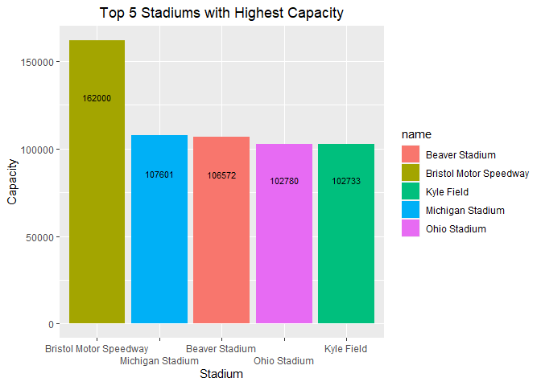

ST 558: Project 2
================
Chandler Ellsworth
2023-10-02

The document is a vignette about contacting the
`CollegeFootballData.com` (CFBD) API using created functions to query,
parse, and return well-structured data. CFBD is a sports statistics and
analytics website with no direct affiliation to the NCAA, its member
conferences, or its member teams.

The functions will be used in this document to obtain data from the API
as well as some basic exploratory data analysis. The functions can be
used to gather the following types of data:

- talent composite ranking for a particular season by team  
- coaching history based on first and last name  
- high level team stats for a particular season and team  
- high level game results for a particular season and team  
- ending record for a particular season and team  
- general information for college football venues

\#Overal

``` r
library(httr2)
library(jsonlite)
library(tidyverse)
```

``` r
token <- 'L8SLuL2Jzi8KI5g0iHQYaERuCZgEDvyxDpOvDTgSqrLWvU7/8Yd5XuAPCfZJjMCJ'

req <- request("https://api.collegefootballdata.com/venues") %>% 
  req_auth_bearer_token(token) %>% 
  req_headers("Accept" = "application/json")

mydata <- req_perform(req)

mydf <- fromJSON(rawToChar(mydata$body))

mytib <- as_tibble(mydf)

mytib %>%
  select(name, capacity, grass, city, state, elevation, year_constructed, dome)
```

    ## # A tibble: 816 × 8
    ##    name          capacity grass city  state elevation year_constructed dome 
    ##    <chr>            <int> <lgl> <chr> <chr> <chr>                <int> <lgl>
    ##  1 Abbott Memor…    10000 NA    Tusk… AL    122.8                 1925 FALSE
    ##  2 Abel Stadium      2500 NA    Linc… NE    <NA>                    NA FALSE
    ##  3 Ace W. Mumfo…    28500 FALSE Bato… LA    20.24213…             1928 FALSE
    ##  4 ACU Football…        0 NA    Glen… AZ    <NA>                    NA FALSE
    ##  5 Adamson Stad…     6500 NA    Brow… PA    <NA>                    NA FALSE
    ##  6 Aggie Memori…    28853 FALSE Las … NM    1208.201…             1978 FALSE
    ##  7 Aggie Stadium    21500 TRUE  Gree… NC    235.1224…             1981 FALSE
    ##  8 Aggie Stadium    10743 FALSE Davis CA    11.38259…             2007 FALSE
    ##  9 A.J. McClung…        0 NA    Colu… GA    <NA>                    NA FALSE
    ## 10 A.J. Simeon …    15000 NA    High… NC    <NA>                    NA FALSE
    ## # ℹ 806 more rows

``` r
team_talent_composite_rankings <- function(year) {
  
  token <- 'L8SLuL2Jzi8KI5g0iHQYaERuCZgEDvyxDpOvDTgSqrLWvU7/8Yd5XuAPCfZJjMCJ'
  
  url <- paste0("https://api.collegefootballdata.com/talent?year=",year)
  
  req <- request(url) %>% 
    req_auth_bearer_token(token) %>% 
    req_headers("Accept" = "application/json")
  
  mydata <- req_perform(req)
  
  mydf <- fromJSON(rawToChar(mydata$body))
  
  mytib <- as_tibble(mydf)
  
  mytib$talent <- as.integer(mytib$talent)
  
  return(mytib)

}
```

``` r
coaching_history <- function(first_name, last_name) {
  token <- 'L8SLuL2Jzi8KI5g0iHQYaERuCZgEDvyxDpOvDTgSqrLWvU7/8Yd5XuAPCfZJjMCJ'
  
  url <- paste0("https://api.collegefootballdata.com/coaches?firstName=",first_name,"&lastName=",last_name)
  
  req <- request(url) %>% 
    req_auth_bearer_token(token) %>% 
    req_headers("Accept" = "application/json")
  
  mydata <- req_perform(req)
  
  mydf <- fromJSON(rawToChar(mydata$body))$seasons
  
  mytib <- as_tibble(mydf[[1]])
  
  return(mytib)
}
```

``` r
team_season_stats <- function(year, team) {
  token <- 'L8SLuL2Jzi8KI5g0iHQYaERuCZgEDvyxDpOvDTgSqrLWvU7/8Yd5XuAPCfZJjMCJ'
  
  first_name <- word(team, 1)
  last_name <- word(team, 2)
  
  url <- ifelse(grepl(" ", team),
                paste0("https://api.collegefootballdata.com/stats/season?year=",
                       year,"&team=",first_name,"%20",last_name),
                paste0("https://api.collegefootballdata.com/stats/season?year=",
                       year,"&team=",team))
  
  req <- request(url) %>% 
    req_auth_bearer_token(token) %>% 
    req_headers("Accept" = "application/json")
  
  mydata <- req_perform(req)
  
  mydf <- fromJSON(rawToChar(mydata$body))
  
  mytib <- as_tibble(mydf)
  
  return(mytib)
}
```

``` r
game_results <- function(year, team) {
  token <- 'L8SLuL2Jzi8KI5g0iHQYaERuCZgEDvyxDpOvDTgSqrLWvU7/8Yd5XuAPCfZJjMCJ'
  
  first_name <- word(team, 1)
  last_name <- word(team, 2)
  
  url <- ifelse(grepl(" ", team),
                paste0("https://api.collegefootballdata.com/games?year=",
                       year,"&seasonType=regular&team=",first_name,"%20",last_name),
                paste0("https://api.collegefootballdata.com/games?year=",
                       year,"&seasonType=regular&team=",team))
  
  req <- request(url) %>% 
  req_auth_bearer_token(token) %>% 
  req_headers("Accept" = "application/json")

  mydata <- req_perform(req)

  mydf <- fromJSON(rawToChar(mydata$body))

  mytib <- as_tibble(mydf)

  mytib <- mytib %>%
    select(season, week, attendance, venue, home_team, home_points, away_team, away_points, excitement_index)
  
  return(mytib)
}
```

``` r
team_records <- function(year, team) {
  token <- 'L8SLuL2Jzi8KI5g0iHQYaERuCZgEDvyxDpOvDTgSqrLWvU7/8Yd5XuAPCfZJjMCJ'
  
  first_name <- word(team, 1)
  last_name <- word(team, 2)
  
  url <- ifelse(grepl(" ", team),
                paste0("https://api.collegefootballdata.com/records?year=",
                       year,"&team=",first_name,"%20",last_name),
                paste0("https://api.collegefootballdata.com/records?year=",
                       year,"&team=",team))
  
  req <- request(url) %>% 
    req_auth_bearer_token(token) %>% 
    req_headers("Accept" = "application/json")

  mydata <- req_perform(req)

  mydf <- fromJSON(rawToChar(mydata$body))$total

  mytib <- as_tibble(mydf)
  
  return(mytib)
}
```

``` r
venue_info <- function(venue_name = NULL) {
  token <- 'L8SLuL2Jzi8KI5g0iHQYaERuCZgEDvyxDpOvDTgSqrLWvU7/8Yd5XuAPCfZJjMCJ'

  req <- request("https://api.collegefootballdata.com/venues") %>% 
    req_auth_bearer_token(token) %>% 
    req_headers("Accept" = "application/json")

  mydata <- req_perform(req)

  mydf <- fromJSON(rawToChar(mydata$body))

  mytib <- as_tibble(mydf)

  mytib <- mytib %>%
    select(name, capacity, grass, city, state, elevation, year_constructed, dome)
  
  ifelse(!is.null(venue_name),
         mytib <- mytib %>%
           filter(name == venue_name),
         NA)
  
  return(mytib)
}
```

``` r
years <- c(2015, 2016, 2017, 2018, 2019, 2020, 2021, 2022, 2023)

listy <- list()

for (year in years) {
  
  mytib <- team_talent_composite_rankings(year)
  
  listy <- append(listy, list(mytib), 0)
}

talent <- bind_rows(listy)

average <- talent %>%
  group_by(school) %>%
  summarise(average_talent = round(mean(talent),2)) %>%
  arrange(desc(average_talent))

ggplot(average[1:10,], aes(x = reorder(school, -average_talent), y = average_talent,
                           fill = school)) +
  geom_bar(stat = "identity") + 
  labs(x = "School",
       y = "Average Talent",
       title = "Average School Talent Over Past 8 Years",) +
  scale_fill_discrete(name = "School") +
  theme(plot.title = element_text(hjust = 0.5)) +
  scale_x_discrete(guide = guide_axis(n.dodge=2)) +
  geom_text(aes(label = average_talent,), size = 3, position = position_stack(vjust = 0.8))
```

<!-- -->

``` r
listy2 <- average[1:10,]$school

talent_filter <- talent %>%
  filter(school %in% listy2)

ggplot(talent_filter, aes(x = school, y = year, fill = talent)) +
  geom_tile() +
  scale_fill_gradient(low="white", high="blue") +
  labs(x = "School",
       y = "Year",
       title = "School Talent Over Past 8 Years",) +
  theme(plot.title = element_text(hjust = 0.5)) +
  scale_x_discrete(guide = guide_axis(n.dodge=2))
```

<!-- -->
