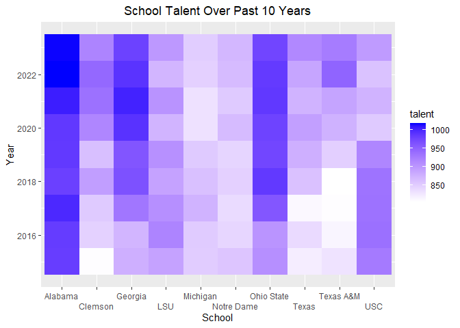
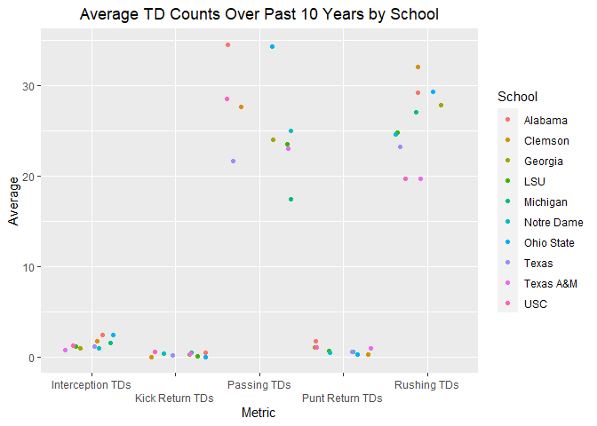
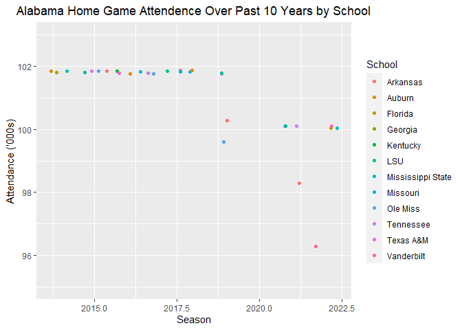

ST 558: Project 2
================
Chandler Ellsworth
2023-10-02

- [Requirment Packages](#requirment-packages)
- [API Interaction Functions](#api-interaction-functions)
  - [`team_talent_composite_ranking`](#team_talent_composite_ranking)
  - [coaching_history](#coaching_history)
  - [`team_season_stats`](#team_season_stats)
  - [`game_results`](#game_results)
  - [`team_records`](#team_records)
  - [`venue_info`](#venue_info)
- [Exploratory Data Analysis](#exploratory-data-analysis)
- [Wrap Up](#wrap-up)

The document is a vignette about contacting the
`CollegeFootballData.com` (CFBD) API using created functions to query,
parse, and return well-structured data. CFBD is a sports statistics and
analytics website with no direct affiliation to the NCAA, its member
conferences, or its member teams.

The functions will be used in this document to obtain data from the API
as well as some basic exploratory data analysis. The functions can be
used to gather the following types of data:

- talent composite ranking for a particular season by team  
- coaching history based on first and last name  
- high level team stats for a particular season and team  
- high level game results for a particular season and team  
- ending record for a particular season and team  
- general information for college football venues

# Requirment Packages

The following packages were used to interact with the CFBD API:

- `httr2` Tools for creating and modifying HTTP request, then performing
  them and processing the results  
- `jsonlite`: JSON parser/generator optimized for the web  
- `tidyverse`: Opinionated collection of R packages designed for data
  science  
- `ggplot2`: Great open-source data visualization package

# API Interaction Functions

The following section will lay out the created functions described above
in more detail.

### `team_talent_composite_ranking`

This function allows the user to query on a specific football season
(year) and return talent composite rankings in the form of a tibble. If
multiple seasons want to be analyzed, a form of `apply` could utilize
this function to pull in talent composite rankings across multiple
seasons. There is no default to the `year` argument, so make sure to
specify that during the function call.

``` r
team_talent_composite_rankings <- function(year) {
  #utilize my required key needed for interacting with the API
  token <- 'L8SLuL2Jzi8KI5g0iHQYaERuCZgEDvyxDpOvDTgSqrLWvU7/8Yd5XuAPCfZJjMCJ'
  #create the url needed to pull the data in, which allows for different years
  url <- paste0("https://api.collegefootballdata.com/talent?year=",year)
  #performs the HTTP request with the specified token
  req <- request(url) %>%
    req_auth_bearer_token(token) %>%
    #tailor HTTP request with headers
    req_headers("Accept" = "application/json")
  #perform the request and fetch the response
  mydata <- req_perform(req)
  #convert JSON structure to characters and grab the body element of the list 
  #which contains the relevant data
  mydf <- fromJSON(rawToChar(mydata$body))
  #convert to tibble
  mytib <- as_tibble(mydf)
  #make the talent column an integer to do analysis on
  mytib$talent <- as.integer(mytib$talent)
  
  return(mytib)
}
```

### coaching_history

This function allows the user to analyze the performance history of a
specific coach, such as wins, losses, rankings, schools, etc. The
arguments are `first_name` and `last_name`, with no defaults so make
sure these are populated and given as a character, between quotation,
such as `"name"`. From my testing, it does not seem to matter if you
capitalize the first or last name. Some form of `apply` can also be used
to pull in data for multiple coaches.

``` r
coaching_history <- function(first_name, last_name) {
  #same procedure from first function
  token <- 'L8SLuL2Jzi8KI5g0iHQYaERuCZgEDvyxDpOvDTgSqrLWvU7/8Yd5XuAPCfZJjMCJ'
  
  url <- paste0("https://api.collegefootballdata.com/coaches?firstName=",first_name,"&lastName=",last_name)
  
  req <- request(url) %>% 
    req_auth_bearer_token(token) %>% 
    req_headers("Accept" = "application/json")
  
  mydata <- req_perform(req)
  #data on this request is stored slightly differently, with the relevant data
  #frame of data stored in the seasons column, so pull that in
  mydf <- fromJSON(rawToChar(mydata$body))$seasons
  #the data relevant to coaching history is the first element, so conver to a tibble
  mytib <- as_tibble(mydf[[1]])
  
  return(mytib)
}
```

### `team_season_stats`

This function allows the user to analyze high level team stats for a
particular season and team. Stats are relevant to both the offensive and
defensive side of the pall, so plenty of things to filter on. The
required arguments, with no defaults, are `year` and `team`, so make
sure these are populated. Year in the form of an integer and team as a
character string wrapped between quotations. One thing to note is that
this function may not work for very unique school names that have
specific characters included in their name. It should work for schools
that don’t have any symbols. One thing that was built in was a `&` in
the second name, such as `Texas A&M`. For multiple years worth of stats,
some for of the `apply` function could be used.

``` r
team_season_stats <- function(year, team) {
  
  token <- 'L8SLuL2Jzi8KI5g0iHQYaERuCZgEDvyxDpOvDTgSqrLWvU7/8Yd5XuAPCfZJjMCJ'
  #store the first name of team provided
  first_name <- word(team, 1)
  #store the last name of the team provided
  last_name <- word(team, 2)
  #unique case for Texas A&M, since it's such a relevant football school
  #within the last name, store the first letter before the &
  A <- word(word(team, 1, sep = "&"),2)
  #within the last name, store the second letter after the &
  M <- word(team, 2, sep = "&")
  #use if else logic as the url changes based on if the team provided is one word,
  # two words, or the unique case with the & in last name
  url <- ifelse(grepl("&", team), paste0("https://api.collegefootballdata.com/stats/season?year=",
                       year,"&team=",first_name,"%20",A,"%26",M),
                ifelse(grepl(" ", team),
                       paste0("https://api.collegefootballdata.com/stats/season?year=",year,"&team=",
                              first_name,"%20",last_name),
                       paste0("https://api.collegefootballdata.com/stats/season?year=",year,"&team=",team)))
  
  req <- request(url) %>% 
    req_auth_bearer_token(token) %>% 
    req_headers("Accept" = "application/json")
  
  mydata <- req_perform(req)
  
  mydf <- fromJSON(rawToChar(mydata$body))
  
  mytib <- as_tibble(mydf)
  
  return(mytib)
}
```

### `game_results`

This function allows the user to at high level game results for a
particular season and team such as scores, teams, attendance, and week.
The required arguments, with no defaults, are `year` and `team`, so make
sure these are populated. Year in the form of an integer and team as a
character string wrapped between quotations. One thing to note is that
this function may not work for very unique school names that have
specific characters included in their name. It should work for schools
that don’t have any symbols. One thing that was built in was a `&` in
the second name, such as `Texas A&M`. For multiple years worth of game
results, some for of the `apply` function could be used.

``` r
game_results <- function(year, team) {
  #same code format utilized in the team stats function, with a different url
  token <- 'L8SLuL2Jzi8KI5g0iHQYaERuCZgEDvyxDpOvDTgSqrLWvU7/8Yd5XuAPCfZJjMCJ'
  
  first_name <- word(team, 1)
  last_name <- word(team, 2)
  A <- word(word(team, 1, sep = "&"),2)
  M <- word(team, 2, sep = "&")
  
  url <- ifelse(grepl("&", team), paste0("https://api.collegefootballdata.com/games?year=",
                       year,"&seasonType=regular&team=",first_name,"%20",A,"%26",M),
                ifelse(grepl(" ", team),
                       paste0("https://api.collegefootballdata.com/games?year=",
                              year,"&seasonType=regular&team=",first_name,"%20",last_name),
                       paste0("https://api.collegefootballdata.com/games?year=",
                              year,"&seasonType=regular&team=",team)))
  
  req <- request(url) %>% 
  req_auth_bearer_token(token) %>% 
  req_headers("Accept" = "application/json")
  
  mydata <- req_perform(req)
  
  mydf <- fromJSON(rawToChar(mydata$body))
  
  mytib <- as_tibble(mydf)
  #there were numerous columns that were not helpful, so only select relevant columns
  mytib <- mytib %>%
    select(season, week, away_conference, attendance, venue, home_team, home_points,
           away_team, away_points, excitement_index)
  
  return(mytib)
}
```

### `team_records`

This simple function allows the user to return the record for a specific
year and team. The required arguments, with no defaults, are `year` and
`team`, so make sure these are populated. Year in the form of an integer
and team as a character string wrapped between quotations. One thing to
note is that this function may not work for very unique school names
that have specific characters included in their name. It should work for
schools that don’t have any symbols. One thing that was built in was a
`&` in the second name, such as `Texas A&M`. For multiple years worth of
team records, some form of the `apply` function could be used.

``` r
team_records <- function(year, team) {
  #similar code to above functions involving year and team, with a different url
  token <- 'L8SLuL2Jzi8KI5g0iHQYaERuCZgEDvyxDpOvDTgSqrLWvU7/8Yd5XuAPCfZJjMCJ'
  
  first_name <- word(team, 1)
  last_name <- word(team, 2)
  A <- word(word(team, 1, sep = "&"),2)
  M <- word(team, 2, sep = "&")
  
  url <- ifelse(grepl("&", team), paste0("https://api.collegefootballdata.com/records?year=",
                                         year,"&team=",first_name,"%20",A,"%26",M),
                ifelse(grepl(" ", team),
                       paste0("https://api.collegefootballdata.com/records?year=",
                              year,"&team=",first_name,"%20",last_name),
                       paste0("https://api.collegefootballdata.com/records?year=",
                              year,"&team=",team)))
  
  req <- request(url) %>% 
    req_auth_bearer_token(token) %>% 
    req_headers("Accept" = "application/json")
  
  mydata <- req_perform(req)
  #df we want is stored in the total columns, so pull that in
  mydf <- fromJSON(rawToChar(mydata$body))$total
  
  mytib <- as_tibble(mydf)
  
  return(mytib)
}
```

### `venue_info`

The function allows the user to see high level information for the
different venues in college football. The only argument that is
specified is `venue_name`, if one only wanted to look at one venue. This
is an optional argument, so if it is not specified, all venues will be
returned. If a venue name is specified, make sure it is spelled
correctly and between quotations.

``` r
venue_info <- function(venue_name = NULL) {
  #same as previous function, with a different url
  token <- 'L8SLuL2Jzi8KI5g0iHQYaERuCZgEDvyxDpOvDTgSqrLWvU7/8Yd5XuAPCfZJjMCJ'

  req <- request("https://api.collegefootballdata.com/venues") %>% 
    req_auth_bearer_token(token) %>% 
    req_headers("Accept" = "application/json")
  
  mydata <- req_perform(req)
  
  mydf <- fromJSON(rawToChar(mydata$body))
  
  mytib <- as_tibble(mydf)
  #select only useful columns for data analysis 
  mytib <- mytib %>%
    select(name, capacity, grass, city, state, elevation, year_constructed, dome)
  #if venue name is given in the function call, filter the tibble on 
  #that specific venue
  ifelse(!is.null(venue_name),
         mytib <- mytib %>%
           filter(name == venue_name),
         NA)
  
  return(mytib)
}
```

# Exploratory Data Analysis

Now that we have functions that can be utilized to query on different
endpoint of the CFDB API, let do some basic exploratory data analysis.
Since the majority of the functions created can only pull in one year at
a time, I will utilize a form of the `apply` function to look at data
from the past 10 seasons, gathering averages for overall analysis of
performance. Some of the things I’m interested in are as follows:

- How does team talent rankings for the most talented teams transfer to
  actual performance?  
- For the overall most talented team based on the past 10 seasons, which
  opponents draw in the highest crowd attendance?  
- For the most tenured active head coaches, how do their win totals
  compare and how many different schools have they coached at?  
- Which stadiums have the highest capacity?

First, I need to create a vector of the last 10 seasons and create an
empty list that multiple data frames can be appended to. For the sake of
practicing different methods, I am going to perform a `for loop` for
this task. I will loop through each of the seasons, run the
`team_talent_composite_rankings` function and group by the school,
finding the average talent for each team, sorted from highest to lowest.
To help visualize this, I will plot the 10 highest average talent
rankings with a bar chart.

``` r
#create vector for different seasons
years <- c(2014, 2015, 2016, 2017, 2018, 2019, 2020, 2021, 2022, 2023)
#create empty list to append data frames from for loop
listy <- list()
#use for loop to iterate through each year in years vector
for (year in years) {
  #get talent composite rankings
  mytib <- team_talent_composite_rankings(year)
  #append data frame to list
  listy <- append(listy, list(mytib), 0)
}
#merge all the data frame elements in the list
talent <- bind_rows(listy)
#use the talent data frame to group by school and find the average talent,
#arranged from highest to lowest
average <- talent %>%
  group_by(school) %>%
  summarise(average_talent = round(mean(talent),2)) %>%
  arrange(desc(average_talent))
#plot bar graph using the indexed average df for the top 10 average talent rankings
ggplot(average[1:10,], aes(x = reorder(school, -average_talent),
                           y = average_talent,
                           #create different colors for each school
                           fill = school)) +
  #create bar chart
  geom_bar(stat = "identity") + 
  #add appropriate labels to the chart for title, axes, and legend
  labs(x = "School",
       y = "Average Talent",
       title = "Average School Talent Over Past 10 Years") +
  scale_fill_discrete(name = "School") +
  #put the chart title in the center
  theme(plot.title = element_text(hjust = 0.5)) +
  #make sure x axis elements are not overlapping
  scale_x_discrete(guide = guide_axis(n.dodge=2)) +
  #add data labels for each school
  geom_text(aes(label = average_talent,), 
            size = 3, 
            position = position_stack(vjust = 0.8))
```

<!-- --> It looks like
there is a fairly large drop off after the first three schools, with
`Alabama` dominating over the past 10 seasons. There is a material
difference between Alabama and Michigan, the first and tenth highest
average rankings. Luckily my alma mater, `Texas A&M`, cracks the top 10!

Next, for the top 10 ranked schools, lets use a `heat map` to see the
trend of how the rankings for each individual season have fared for each
school.

``` r
#create a unique list of schools that make the top 10
listy2 <- average[1:10,]$school
#filter the talent data frame for the schools in the top 10
talent_filter <- talent %>%
  filter(school %in% listy2)
#fill this time by talent
ggplot(talent_filter, aes(x = school, y = year, fill = talent)) +
  #create the heat map
  geom_tile() +
  #change gradient scheme of low and high values to white and blue, respectively
  scale_fill_gradient(low="white", high="blue") +
  #add appropriate labels
  labs(x = "School",
       y = "Year",
       title = "School Talent Over Past 10 Years",) +
  #adjust title to center
  theme(plot.title = element_text(hjust = 0.5)) +
  #make sure x axis labels are not overlapping
  scale_x_discrete(guide = guide_axis(n.dodge=2))
```

<!-- --> It looks like
from the heat map that `Alabama` has consistently remained top of the
list for each of the individual 10 seasons. `Georgia` and `Ohio State`
seem to have done a great job over the last 10 season bringing in top
talent, slowly increasing their overall talent rankings. `USC` on the
other hand, seems to have slightly regressed over the top 10 seasons in
the talent they are bringing in.

We can also gauge a measure of spread for each team by looking at the
standard deviation of composite rankings. This is done very similarly to
the average talent but, using the `sd` function, and filtering on the
relevant schools.

``` r
#filter the talent df for the relevant schools of interest
sd <- talent %>%
  filter(school %in% listy2) %>%
  #group by school
  group_by(school) %>%
  #use sd as the summary measure
  summarise(sd_talent = round(sd(talent),2)) %>%
  #sort descending
  arrange(desc(sd_talent))

sd
```

<div data-pagedtable="false">

<script data-pagedtable-source type="application/json">
{"columns":[{"label":["school"],"name":[1],"type":["chr"],"align":["left"]},{"label":["sd_talent"],"name":[2],"type":["dbl"],"align":["right"]}],"data":[{"1":"Texas A&M","2":"52.20"},{"1":"Georgia","2":"48.15"},{"1":"Clemson","2":"46.04"},{"1":"Texas","2":"34.14"},{"1":"USC","2":"33.28"},{"1":"Ohio State","2":"32.64"},{"1":"LSU","2":"15.47"},{"1":"Alabama","2":"14.93"},{"1":"Michigan","2":"13.18"},{"1":"Notre Dame","2":"12.01"}],"options":{"columns":{"min":{},"max":[10]},"rows":{"min":[10],"max":[10]},"pages":{}}}
  </script>

</div>

Unfortunately for the school I care about most, it looks like
`Texas A&M` has the most variability each year in their composite
rankings for the schools of relevance. As suspected, `Alabama` has
little variability in their scores, along with `Michigan` and
`Notre Dame`, which are in a slighly lower tier.

Lets see how well the average talent rankings translate to performance.
One metric we can use to analyze this is looking at average margin of
victory over the last 10 seasons. The thought process here is that
higher talent will make a team more likely to win games and at a higher
margin.

To do this, we’ll need to create a grid of each season and team. We’ll
use a different approach then a for loop by utilizing `apply` to run the
`game_results` function across each combination of season and team.
Since the `game_results` output only has home and away scores, not the
difference, we’ll have to add a new column and calculate this ourselves.
We’ll merge all the data frames together, and group by team on the
output. We’ll summarize the new point differential column for the
average and arrage from highest to smallest. We’ll visualize the results
through a bar graph.

``` r
#create a combo of each season and team
combo <- expand.grid(years, listy2)
#apply the game results function to each combo of season and team
game_results_tib <- apply(combo, MARGIN = 1, 
                  FUN = function(x) {
                    #first element is the season, second element is the team
                    tib <- game_results(x[1],x[2])
                    tib$team <- x[2]
                    #use if else logic to check if the home team corresponds to the
                    #team of relevance. If it is home team, to home - away points. If 
                    # not do the opposite
                    if_else(tib$home_team == x[2], 
                            mutate(tib, point_diff = (home_points - away_points)), 
                                   mutate(tib, point_diff = (away_points - home_points)))})
#bind all the data frame results together, filtering out any na values in
# point differential as these were bad data points
bind_game_results <- bind_rows(game_results_tib) %>%
  filter(!is.na(point_diff))
#group the consolidated df by team, pulling in a summary of average point diff,
#arranged highest to smallest
bind_gr_avg <- bind_game_results %>%
  group_by(team) %>%
  summarise(avg_point_margin = mean(point_diff)) %>%
  arrange(desc(avg_point_margin))
#use reorder to get the bar chart results in descending order, filled by team
ggplot(bind_gr_avg, aes(x = reorder(team, -avg_point_margin), 
                         y = avg_point_margin,
                         fill = team)) +
  #since we already calculated the average, make the stat to identity
  geom_bar(stat = "identity") + 
  #add appropriate labels
  labs(x = "School",
       y = "Average Margin of Victory",
       title = "Average Margin of Victory Over Past 10 Years") +
  scale_fill_discrete(name = "School") +
  #move chart tile to the center
  theme(plot.title = element_text(hjust = 0.5)) +
  #make sure no overlapping labels on x axis
  scale_x_discrete(guide = guide_axis(n.dodge=2)) +
  #add data labels for each school
  geom_text(aes(label = round(avg_point_margin, 2)), 
            size = 3, 
            position = position_stack(vjust = 0.8))
```

<!-- -->

It looks like overall, the teams with the highest average talent, beat
teams by a higher margin. `Clemson` and `Michigan` seem to be making a
great use of who the recruit, based on their composite rankings. `USC`
seems to have higher talent, but not translating that as well to margin
of victory. Explanations to this could be based on the conference each
team is in, as well as `USC`’s talent regressing over the past few years
indicated by the heat map. `Alabama` remains at the top of both metrics,
which is not surprising.

Similarly to the composite rankings, we can see a measure of spread
across the 10 seasons by looking at the standard deviation of the margin
of victory using the sd function under summarise.

``` r
bind_gr_sd <- bind_game_results %>%
  #group by team
  group_by(team) %>%
  #use sd as the summarise measure, rounding to two decimals
  summarise(sd_point_margin = round(sd(point_diff),2)) %>%
  #arrange in descending order
  arrange(desc(sd_point_margin))

bind_gr_sd
```

<div data-pagedtable="false">

<script data-pagedtable-source type="application/json">
{"columns":[{"label":["team"],"name":[1],"type":["chr"],"align":["left"]},{"label":["sd_point_margin"],"name":[2],"type":["dbl"],"align":["right"]}],"data":[{"1":"Texas A&M","2":"22.16"},{"1":"Michigan","2":"22.08"},{"1":"LSU","2":"21.21"},{"1":"Ohio State","2":"21.13"},{"1":"Georgia","2":"20.25"},{"1":"Clemson","2":"20.07"},{"1":"Texas","2":"19.55"},{"1":"USC","2":"19.32"},{"1":"Notre Dame","2":"18.37"},{"1":"Alabama","2":"18.12"}],"options":{"columns":{"min":{},"max":[10]},"rows":{"min":[10],"max":[10]},"pages":{}}}
  </script>

</div>

Also similar to the results of the standard deviation of composite
rankings, `Texas A&M` has the most variability over the 10 season period
in terms of margin of victory. `Alabama` has the least variability,
meaning they are going to be more consistent across seasons in terms of
their margin of victory.

We can also dive into more specific metrics, such as how each of these
teams scores their touchdowns, to give them the margin of victories they
each have. We will do this by using the `apply` function on the
`team_season_stats` function across each combo of season and team. We
will find averages for each of the statistics that include `TD` in them
and plot using a scatter plot.

``` r
#apply the team season stats function to each combo of season and team
team_stat_tib <- apply(combo, MARGIN = 1, 
                  FUN = function(x) team_season_stats(x[1],x[2]))
#merge all the data frames together
team_stat <- bind_rows(team_stat_tib)
team_stat
```

<div data-pagedtable="false">

<script data-pagedtable-source type="application/json">
{"columns":[{"label":["season"],"name":[1],"type":["int"],"align":["right"]},{"label":["team"],"name":[2],"type":["chr"],"align":["left"]},{"label":["conference"],"name":[3],"type":["chr"],"align":["left"]},{"label":["statName"],"name":[4],"type":["chr"],"align":["left"]},{"label":["statValue"],"name":[5],"type":["int"],"align":["right"]}],"data":[{"1":"2014","2":"Alabama","3":"SEC","4":"thirdDownConversions","5":"102"},{"1":"2014","2":"Alabama","3":"SEC","4":"puntReturnTDs","5":"0"},{"1":"2014","2":"Alabama","3":"SEC","4":"interceptionYards","5":"84"},{"1":"2014","2":"Alabama","3":"SEC","4":"turnovers","5":"22"},{"1":"2014","2":"Alabama","3":"SEC","4":"penalties","5":"69"},{"1":"2014","2":"Alabama","3":"SEC","4":"firstDowns","5":"340"},{"1":"2014","2":"Alabama","3":"SEC","4":"kickReturns","5":"50"},{"1":"2014","2":"Alabama","3":"SEC","4":"passCompletions","5":"290"},{"1":"2014","2":"Alabama","3":"SEC","4":"fourthDownConversions","5":"10"},{"1":"2014","2":"Alabama","3":"SEC","4":"fourthDowns","5":"13"},{"1":"2014","2":"Alabama","3":"SEC","4":"passesIntercepted","5":"11"},{"1":"2014","2":"Alabama","3":"SEC","4":"rushingYards","5":"2893"},{"1":"2014","2":"Alabama","3":"SEC","4":"rushingTDs","5":"35"},{"1":"2014","2":"Alabama","3":"SEC","4":"thirdDowns","5":"199"},{"1":"2014","2":"Alabama","3":"SEC","4":"puntReturnYards","5":"234"},{"1":"2014","2":"Alabama","3":"SEC","4":"fumblesRecovered","5":"9"},{"1":"2014","2":"Alabama","3":"SEC","4":"games","5":"14"},{"1":"2014","2":"Alabama","3":"SEC","4":"rushingAttempts","5":"567"},{"1":"2014","2":"Alabama","3":"SEC","4":"penaltyYards","5":"562"},{"1":"2014","2":"Alabama","3":"SEC","4":"puntReturns","5":"25"},{"1":"2014","2":"Alabama","3":"SEC","4":"passAttempts","5":"451"},{"1":"2014","2":"Alabama","3":"SEC","4":"interceptions","5":"10"},{"1":"2014","2":"Alabama","3":"SEC","4":"kickReturnTDs","5":"0"},{"1":"2014","2":"Alabama","3":"SEC","4":"kickReturnYards","5":"1006"},{"1":"2014","2":"Alabama","3":"SEC","4":"fumblesLost","5":"12"},{"1":"2014","2":"Alabama","3":"SEC","4":"passingTDs","5":"32"},{"1":"2014","2":"Alabama","3":"SEC","4":"netPassingYards","5":"3890"},{"1":"2014","2":"Alabama","3":"SEC","4":"totalYards","5":"6783"},{"1":"2014","2":"Alabama","3":"SEC","4":"interceptionTDs","5":"0"},{"1":"2014","2":"Alabama","3":"SEC","4":"possessionTime","5":"27657"},{"1":"2015","2":"Alabama","3":"SEC","4":"thirdDownConversions","5":"80"},{"1":"2015","2":"Alabama","3":"SEC","4":"totalYards","5":"6406"},{"1":"2015","2":"Alabama","3":"SEC","4":"turnovers","5":"17"},{"1":"2015","2":"Alabama","3":"SEC","4":"fumblesLost","5":"7"},{"1":"2015","2":"Alabama","3":"SEC","4":"interceptionYards","5":"462"},{"1":"2015","2":"Alabama","3":"SEC","4":"passingTDs","5":"22"},{"1":"2015","2":"Alabama","3":"SEC","4":"possessionTime","5":"30191"},{"1":"2015","2":"Alabama","3":"SEC","4":"puntReturns","5":"47"},{"1":"2015","2":"Alabama","3":"SEC","4":"interceptionTDs","5":"4"},{"1":"2015","2":"Alabama","3":"SEC","4":"passAttempts","5":"446"},{"1":"2015","2":"Alabama","3":"SEC","4":"passesIntercepted","5":"19"},{"1":"2015","2":"Alabama","3":"SEC","4":"passCompletions","5":"301"},{"1":"2015","2":"Alabama","3":"SEC","4":"fumblesRecovered","5":"8"},{"1":"2015","2":"Alabama","3":"SEC","4":"penalties","5":"89"},{"1":"2015","2":"Alabama","3":"SEC","4":"firstDowns","5":"329"},{"1":"2015","2":"Alabama","3":"SEC","4":"kickReturnTDs","5":"1"},{"1":"2015","2":"Alabama","3":"SEC","4":"penaltyYards","5":"835"},{"1":"2015","2":"Alabama","3":"SEC","4":"fourthDowns","5":"24"},{"1":"2015","2":"Alabama","3":"SEC","4":"fourthDownConversions","5":"12"},{"1":"2015","2":"Alabama","3":"SEC","4":"puntReturnYards","5":"597"},{"1":"2015","2":"Alabama","3":"SEC","4":"games","5":"15"},{"1":"2015","2":"Alabama","3":"SEC","4":"interceptions","5":"10"},{"1":"2015","2":"Alabama","3":"SEC","4":"rushingTDs","5":"33"},{"1":"2015","2":"Alabama","3":"SEC","4":"rushingAttempts","5":"642"},{"1":"2015","2":"Alabama","3":"SEC","4":"kickReturns","5":"39"},{"1":"2015","2":"Alabama","3":"SEC","4":"puntReturnTDs","5":"5"},{"1":"2015","2":"Alabama","3":"SEC","4":"netPassingYards","5":"3407"},{"1":"2015","2":"Alabama","3":"SEC","4":"rushingYards","5":"2999"},{"1":"2015","2":"Alabama","3":"SEC","4":"kickReturnYards","5":"803"},{"1":"2015","2":"Alabama","3":"SEC","4":"thirdDowns","5":"215"},{"1":"2016","2":"Alabama","3":"SEC","4":"interceptions","5":"9"},{"1":"2016","2":"Alabama","3":"SEC","4":"games","5":"15"},{"1":"2016","2":"Alabama","3":"SEC","4":"kickReturns","5":"28"},{"1":"2016","2":"Alabama","3":"SEC","4":"fumblesLost","5":"10"},{"1":"2016","2":"Alabama","3":"SEC","4":"rushingYards","5":"3675"},{"1":"2016","2":"Alabama","3":"SEC","4":"fourthDowns","5":"17"},{"1":"2016","2":"Alabama","3":"SEC","4":"interceptionTDs","5":"6"},{"1":"2016","2":"Alabama","3":"SEC","4":"passingTDs","5":"26"},{"1":"2016","2":"Alabama","3":"SEC","4":"penaltyYards","5":"660"},{"1":"2016","2":"Alabama","3":"SEC","4":"thirdDowns","5":"209"},{"1":"2016","2":"Alabama","3":"SEC","4":"penalties","5":"85"},{"1":"2016","2":"Alabama","3":"SEC","4":"passCompletions","5":"265"},{"1":"2016","2":"Alabama","3":"SEC","4":"kickReturnTDs","5":"0"},{"1":"2016","2":"Alabama","3":"SEC","4":"puntReturns","5":"36"},{"1":"2016","2":"Alabama","3":"SEC","4":"kickReturnYards","5":"547"},{"1":"2016","2":"Alabama","3":"SEC","4":"possessionTime","5":"27839"},{"1":"2016","2":"Alabama","3":"SEC","4":"rushingAttempts","5":"639"},{"1":"2016","2":"Alabama","3":"SEC","4":"passesIntercepted","5":"16"},{"1":"2016","2":"Alabama","3":"SEC","4":"fumblesRecovered","5":"11"},{"1":"2016","2":"Alabama","3":"SEC","4":"interceptionYards","5":"398"},{"1":"2016","2":"Alabama","3":"SEC","4":"passAttempts","5":"417"},{"1":"2016","2":"Alabama","3":"SEC","4":"puntReturnYards","5":"528"},{"1":"2016","2":"Alabama","3":"SEC","4":"firstDowns","5":"315"},{"1":"2016","2":"Alabama","3":"SEC","4":"turnovers","5":"19"},{"1":"2016","2":"Alabama","3":"SEC","4":"thirdDownConversions","5":"91"},{"1":"2016","2":"Alabama","3":"SEC","4":"rushingTDs","5":"33"},{"1":"2016","2":"Alabama","3":"SEC","4":"netPassingYards","5":"3154"},{"1":"2016","2":"Alabama","3":"SEC","4":"puntReturnTDs","5":"4"},{"1":"2016","2":"Alabama","3":"SEC","4":"fourthDownConversions","5":"10"},{"1":"2016","2":"Alabama","3":"SEC","4":"tacklesForLoss","5":"118"},{"1":"2016","2":"Alabama","3":"SEC","4":"totalYards","5":"6829"},{"1":"2016","2":"Alabama","3":"SEC","4":"sacks","5":"54"},{"1":"2017","2":"Alabama","3":"SEC","4":"passAttempts","5":"332"},{"1":"2017","2":"Alabama","3":"SEC","4":"turnovers","5":"10"},{"1":"2017","2":"Alabama","3":"SEC","4":"interceptions","5":"3"},{"1":"2017","2":"Alabama","3":"SEC","4":"fourthDownConversions","5":"15"},{"1":"2017","2":"Alabama","3":"SEC","4":"rushingTDs","5":"36"},{"1":"2017","2":"Alabama","3":"SEC","4":"totalYards","5":"6217"},{"1":"2017","2":"Alabama","3":"SEC","4":"rushingAttempts","5":"612"},{"1":"2017","2":"Alabama","3":"SEC","4":"rushingYards","5":"3509"},{"1":"2017","2":"Alabama","3":"SEC","4":"kickReturnTDs","5":"0"},{"1":"2017","2":"Alabama","3":"SEC","4":"kickReturnYards","5":"438"},{"1":"2017","2":"Alabama","3":"SEC","4":"thirdDowns","5":"177"},{"1":"2017","2":"Alabama","3":"SEC","4":"fourthDowns","5":"18"},{"1":"2017","2":"Alabama","3":"SEC","4":"fumblesRecovered","5":"4"},{"1":"2017","2":"Alabama","3":"SEC","4":"interceptionTDs","5":"2"},{"1":"2017","2":"Alabama","3":"SEC","4":"penaltyYards","5":"569"},{"1":"2017","2":"Alabama","3":"SEC","4":"games","5":"14"},{"1":"2017","2":"Alabama","3":"SEC","4":"netPassingYards","5":"2708"},{"1":"2017","2":"Alabama","3":"SEC","4":"interceptionYards","5":"279"},{"1":"2017","2":"Alabama","3":"SEC","4":"puntReturnTDs","5":"0"},{"1":"2017","2":"Alabama","3":"SEC","4":"puntReturnYards","5":"301"},{"1":"2017","2":"Alabama","3":"SEC","4":"puntReturns","5":"39"},{"1":"2017","2":"Alabama","3":"SEC","4":"tacklesForLoss","5":"100"},{"1":"2017","2":"Alabama","3":"SEC","4":"firstDowns","5":"311"},{"1":"2017","2":"Alabama","3":"SEC","4":"passingTDs","5":"28"},{"1":"2017","2":"Alabama","3":"SEC","4":"thirdDownConversions","5":"72"},{"1":"2017","2":"Alabama","3":"SEC","4":"passCompletions","5":"204"},{"1":"2017","2":"Alabama","3":"SEC","4":"kickReturns","5":"20"},{"1":"2017","2":"Alabama","3":"SEC","4":"penalties","5":"70"},{"1":"2017","2":"Alabama","3":"SEC","4":"fumblesLost","5":"7"},{"1":"2017","2":"Alabama","3":"SEC","4":"possessionTime","5":"24993"},{"1":"2017","2":"Alabama","3":"SEC","4":"sacks","5":"40"},{"1":"2017","2":"Alabama","3":"SEC","4":"passesIntercepted","5":"19"},{"1":"2018","2":"Alabama","3":"SEC","4":"passesIntercepted","5":"14"},{"1":"2018","2":"Alabama","3":"SEC","4":"rushingYards","5":"2974"},{"1":"2018","2":"Alabama","3":"SEC","4":"interceptionYards","5":"276"},{"1":"2018","2":"Alabama","3":"SEC","4":"rushingTDs","5":"33"},{"1":"2018","2":"Alabama","3":"SEC","4":"kickReturnYards","5":"523"},{"1":"2018","2":"Alabama","3":"SEC","4":"thirdDowns","5":"165"},{"1":"2018","2":"Alabama","3":"SEC","4":"rushingAttempts","5":"572"},{"1":"2018","2":"Alabama","3":"SEC","4":"firstDowns","5":"372"},{"1":"2018","2":"Alabama","3":"SEC","4":"interceptions","5":"8"},{"1":"2018","2":"Alabama","3":"SEC","4":"puntReturnYards","5":"250"},{"1":"2018","2":"Alabama","3":"SEC","4":"sacks","5":"44"},{"1":"2018","2":"Alabama","3":"SEC","4":"totalYards","5":"7828"},{"1":"2018","2":"Alabama","3":"SEC","4":"interceptionTDs","5":"4"},{"1":"2018","2":"Alabama","3":"SEC","4":"passAttempts","5":"438"},{"1":"2018","2":"Alabama","3":"SEC","4":"tacklesForLoss","5":"105"},{"1":"2018","2":"Alabama","3":"SEC","4":"penaltyYards","5":"796"},{"1":"2018","2":"Alabama","3":"SEC","4":"kickReturnTDs","5":"1"},{"1":"2018","2":"Alabama","3":"SEC","4":"penalties","5":"86"},{"1":"2018","2":"Alabama","3":"SEC","4":"puntReturns","5":"20"},{"1":"2018","2":"Alabama","3":"SEC","4":"passCompletions","5":"301"},{"1":"2018","2":"Alabama","3":"SEC","4":"fumblesLost","5":"8"},{"1":"2018","2":"Alabama","3":"SEC","4":"puntReturnTDs","5":"1"},{"1":"2018","2":"Alabama","3":"SEC","4":"kickReturns","5":"24"},{"1":"2018","2":"Alabama","3":"SEC","4":"turnovers","5":"16"},{"1":"2018","2":"Alabama","3":"SEC","4":"fumblesRecovered","5":"6"},{"1":"2018","2":"Alabama","3":"SEC","4":"fourthDownConversions","5":"7"},{"1":"2018","2":"Alabama","3":"SEC","4":"thirdDownConversions","5":"86"},{"1":"2018","2":"Alabama","3":"SEC","4":"games","5":"15"},{"1":"2018","2":"Alabama","3":"SEC","4":"possessionTime","5":"27411"},{"1":"2018","2":"Alabama","3":"SEC","4":"passingTDs","5":"52"},{"1":"2018","2":"Alabama","3":"SEC","4":"netPassingYards","5":"4854"},{"1":"2018","2":"Alabama","3":"SEC","4":"fourthDowns","5":"16"},{"1":"2019","2":"Alabama","3":"SEC","4":"passAttempts","5":"406"},{"1":"2019","2":"Alabama","3":"SEC","4":"netPassingYards","5":"4449"},{"1":"2019","2":"Alabama","3":"SEC","4":"interceptionTDs","5":"2"},{"1":"2019","2":"Alabama","3":"SEC","4":"penaltyYards","5":"855"},{"1":"2019","2":"Alabama","3":"SEC","4":"thirdDownConversions","5":"80"},{"1":"2019","2":"Alabama","3":"SEC","4":"passesIntercepted","5":"17"},{"1":"2019","2":"Alabama","3":"SEC","4":"passCompletions","5":"287"},{"1":"2019","2":"Alabama","3":"SEC","4":"puntReturns","5":"24"},{"1":"2019","2":"Alabama","3":"SEC","4":"kickReturnTDs","5":"1"},{"1":"2019","2":"Alabama","3":"SEC","4":"rushingTDs","5":"27"},{"1":"2019","2":"Alabama","3":"SEC","4":"games","5":"13"},{"1":"2019","2":"Alabama","3":"SEC","4":"sacks","5":"37"},{"1":"2019","2":"Alabama","3":"SEC","4":"penalties","5":"95"},{"1":"2019","2":"Alabama","3":"SEC","4":"thirdDowns","5":"153"},{"1":"2019","2":"Alabama","3":"SEC","4":"fourthDownConversions","5":"13"},{"1":"2019","2":"Alabama","3":"SEC","4":"turnovers","5":"10"},{"1":"2019","2":"Alabama","3":"SEC","4":"rushingYards","5":"2191"},{"1":"2019","2":"Alabama","3":"SEC","4":"firstDowns","5":"318"},{"1":"2019","2":"Alabama","3":"SEC","4":"kickReturns","5":"31"},{"1":"2019","2":"Alabama","3":"SEC","4":"puntReturnTDs","5":"3"},{"1":"2019","2":"Alabama","3":"SEC","4":"possessionTime","5":"23390"},{"1":"2019","2":"Alabama","3":"SEC","4":"rushingAttempts","5":"436"},{"1":"2019","2":"Alabama","3":"SEC","4":"interceptionYards","5":"245"},{"1":"2019","2":"Alabama","3":"SEC","4":"kickReturnYards","5":"637"},{"1":"2019","2":"Alabama","3":"SEC","4":"puntReturnYards","5":"531"},{"1":"2019","2":"Alabama","3":"SEC","4":"tacklesForLoss","5":"101"},{"1":"2019","2":"Alabama","3":"SEC","4":"fourthDowns","5":"19"},{"1":"2019","2":"Alabama","3":"SEC","4":"fumblesLost","5":"4"},{"1":"2019","2":"Alabama","3":"SEC","4":"passingTDs","5":"49"},{"1":"2019","2":"Alabama","3":"SEC","4":"interceptions","5":"6"},{"1":"2019","2":"Alabama","3":"SEC","4":"fumblesRecovered","5":"17"},{"1":"2019","2":"Alabama","3":"SEC","4":"totalYards","5":"6640"},{"1":"2020","2":"Alabama","3":"SEC","4":"interceptionTDs","5":"3"},{"1":"2020","2":"Alabama","3":"SEC","4":"totalYards","5":"7034"},{"1":"2020","2":"Alabama","3":"SEC","4":"puntReturns","5":"20"},{"1":"2020","2":"Alabama","3":"SEC","4":"kickReturnTDs","5":"0"},{"1":"2020","2":"Alabama","3":"SEC","4":"possessionTime","5":"24032"},{"1":"2020","2":"Alabama","3":"SEC","4":"puntReturnTDs","5":"1"},{"1":"2020","2":"Alabama","3":"SEC","4":"passAttempts","5":"425"},{"1":"2020","2":"Alabama","3":"SEC","4":"rushingAttempts","5":"475"},{"1":"2020","2":"Alabama","3":"SEC","4":"interceptionYards","5":"212"},{"1":"2020","2":"Alabama","3":"SEC","4":"passesIntercepted","5":"12"},{"1":"2020","2":"Alabama","3":"SEC","4":"tacklesForLoss","5":"71"},{"1":"2020","2":"Alabama","3":"SEC","4":"turnovers","5":"12"},{"1":"2020","2":"Alabama","3":"SEC","4":"sacks","5":"27"},{"1":"2020","2":"Alabama","3":"SEC","4":"thirdDownConversions","5":"87"},{"1":"2020","2":"Alabama","3":"SEC","4":"games","5":"13"},{"1":"2020","2":"Alabama","3":"SEC","4":"interceptions","5":"4"},{"1":"2020","2":"Alabama","3":"SEC","4":"firstDowns","5":"365"},{"1":"2020","2":"Alabama","3":"SEC","4":"passCompletions","5":"324"},{"1":"2020","2":"Alabama","3":"SEC","4":"fumblesRecovered","5":"10"},{"1":"2020","2":"Alabama","3":"SEC","4":"fourthDowns","5":"9"},{"1":"2020","2":"Alabama","3":"SEC","4":"netPassingYards","5":"4656"},{"1":"2020","2":"Alabama","3":"SEC","4":"penalties","5":"78"},{"1":"2020","2":"Alabama","3":"SEC","4":"fumblesLost","5":"8"},{"1":"2020","2":"Alabama","3":"SEC","4":"penaltyYards","5":"625"},{"1":"2020","2":"Alabama","3":"SEC","4":"rushingYards","5":"2378"},{"1":"2020","2":"Alabama","3":"SEC","4":"fourthDownConversions","5":"6"},{"1":"2020","2":"Alabama","3":"SEC","4":"rushingTDs","5":"37"},{"1":"2020","2":"Alabama","3":"SEC","4":"kickReturnYards","5":"276"},{"1":"2020","2":"Alabama","3":"SEC","4":"thirdDowns","5":"145"},{"1":"2020","2":"Alabama","3":"SEC","4":"kickReturns","5":"18"},{"1":"2020","2":"Alabama","3":"SEC","4":"puntReturnYards","5":"299"},{"1":"2020","2":"Alabama","3":"SEC","4":"passingTDs","5":"42"},{"1":"2021","2":"Alabama","3":"SEC","4":"fumblesRecovered","5":"6"},{"1":"2021","2":"Alabama","3":"SEC","4":"sacks","5":"57"},{"1":"2021","2":"Alabama","3":"SEC","4":"kickReturnTDs","5":"2"},{"1":"2021","2":"Alabama","3":"SEC","4":"passingTDs","5":"48"},{"1":"2021","2":"Alabama","3":"SEC","4":"penaltyYards","5":"990"},{"1":"2021","2":"Alabama","3":"SEC","4":"games","5":"15"},{"1":"2021","2":"Alabama","3":"SEC","4":"possessionTime","5":"29142"},{"1":"2021","2":"Alabama","3":"SEC","4":"puntReturns","5":"33"},{"1":"2021","2":"Alabama","3":"SEC","4":"puntReturnYards","5":"260"},{"1":"2021","2":"Alabama","3":"SEC","4":"turnovers","5":"13"},{"1":"2021","2":"Alabama","3":"SEC","4":"kickReturnYards","5":"480"},{"1":"2021","2":"Alabama","3":"SEC","4":"passesIntercepted","5":"15"},{"1":"2021","2":"Alabama","3":"SEC","4":"thirdDowns","5":"225"},{"1":"2021","2":"Alabama","3":"SEC","4":"rushingYards","5":"2250"},{"1":"2021","2":"Alabama","3":"SEC","4":"penalties","5":"107"},{"1":"2021","2":"Alabama","3":"SEC","4":"thirdDownConversions","5":"117"},{"1":"2021","2":"Alabama","3":"SEC","4":"netPassingYards","5":"5073"},{"1":"2021","2":"Alabama","3":"SEC","4":"tacklesForLoss","5":"119"},{"1":"2021","2":"Alabama","3":"SEC","4":"totalYards","5":"7323"},{"1":"2021","2":"Alabama","3":"SEC","4":"interceptionTDs","5":"2"},{"1":"2021","2":"Alabama","3":"SEC","4":"passCompletions","5":"380"},{"1":"2021","2":"Alabama","3":"SEC","4":"interceptions","5":"7"},{"1":"2021","2":"Alabama","3":"SEC","4":"interceptionYards","5":"189"},{"1":"2021","2":"Alabama","3":"SEC","4":"rushingAttempts","5":"548"},{"1":"2021","2":"Alabama","3":"SEC","4":"puntReturnTDs","5":"2"},{"1":"2021","2":"Alabama","3":"SEC","4":"fourthDownConversions","5":"9"},{"1":"2021","2":"Alabama","3":"SEC","4":"kickReturns","5":"20"},{"1":"2021","2":"Alabama","3":"SEC","4":"rushingTDs","5":"21"},{"1":"2021","2":"Alabama","3":"SEC","4":"passAttempts","5":"571"},{"1":"2021","2":"Alabama","3":"SEC","4":"firstDowns","5":"367"},{"1":"2021","2":"Alabama","3":"SEC","4":"fumblesLost","5":"6"},{"1":"2021","2":"Alabama","3":"SEC","4":"fourthDowns","5":"17"},{"1":"2022","2":"Alabama","3":"SEC","4":"kickReturns","5":"21"},{"1":"2022","2":"Alabama","3":"SEC","4":"passesIntercepted","5":"7"},{"1":"2022","2":"Alabama","3":"SEC","4":"fourthDowns","5":"15"},{"1":"2022","2":"Alabama","3":"SEC","4":"netPassingYards","5":"3660"},{"1":"2022","2":"Alabama","3":"SEC","4":"interceptionYards","5":"74"},{"1":"2022","2":"Alabama","3":"SEC","4":"penaltyYards","5":"893"},{"1":"2022","2":"Alabama","3":"SEC","4":"sacks","5":"38"},{"1":"2022","2":"Alabama","3":"SEC","4":"totalYards","5":"6204"},{"1":"2022","2":"Alabama","3":"SEC","4":"kickReturnYards","5":"372"},{"1":"2022","2":"Alabama","3":"SEC","4":"tacklesForLoss","5":"84"},{"1":"2022","2":"Alabama","3":"SEC","4":"penalties","5":"103"},{"1":"2022","2":"Alabama","3":"SEC","4":"fumblesRecovered","5":"9"},{"1":"2022","2":"Alabama","3":"SEC","4":"rushingTDs","5":"26"},{"1":"2022","2":"Alabama","3":"SEC","4":"fumblesLost","5":"8"},{"1":"2022","2":"Alabama","3":"SEC","4":"passAttempts","5":"438"},{"1":"2022","2":"Alabama","3":"SEC","4":"thirdDownConversions","5":"74"},{"1":"2022","2":"Alabama","3":"SEC","4":"rushingYards","5":"2544"},{"1":"2022","2":"Alabama","3":"SEC","4":"passingTDs","5":"37"},{"1":"2022","2":"Alabama","3":"SEC","4":"thirdDowns","5":"162"},{"1":"2022","2":"Alabama","3":"SEC","4":"puntReturns","5":"30"},{"1":"2022","2":"Alabama","3":"SEC","4":"games","5":"13"},{"1":"2022","2":"Alabama","3":"SEC","4":"kickReturnTDs","5":"0"},{"1":"2022","2":"Alabama","3":"SEC","4":"firstDowns","5":"310"},{"1":"2022","2":"Alabama","3":"SEC","4":"rushingAttempts","5":"458"},{"1":"2022","2":"Alabama","3":"SEC","4":"puntReturnYards","5":"456"},{"1":"2022","2":"Alabama","3":"SEC","4":"passCompletions","5":"280"},{"1":"2022","2":"Alabama","3":"SEC","4":"interceptions","5":"8"},{"1":"2022","2":"Alabama","3":"SEC","4":"puntReturnTDs","5":"2"},{"1":"2022","2":"Alabama","3":"SEC","4":"possessionTime","5":"23330"},{"1":"2022","2":"Alabama","3":"SEC","4":"interceptionTDs","5":"1"},{"1":"2022","2":"Alabama","3":"SEC","4":"turnovers","5":"16"},{"1":"2022","2":"Alabama","3":"SEC","4":"fourthDownConversions","5":"9"},{"1":"2023","2":"Alabama","3":"SEC","4":"sacks","5":"17"},{"1":"2023","2":"Alabama","3":"SEC","4":"rushingTDs","5":"11"},{"1":"2023","2":"Alabama","3":"SEC","4":"firstDowns","5":"93"},{"1":"2023","2":"Alabama","3":"SEC","4":"fourthDownConversions","5":"1"},{"1":"2023","2":"Alabama","3":"SEC","4":"penaltyYards","5":"244"},{"1":"2023","2":"Alabama","3":"SEC","4":"interceptionYards","5":"91"},{"1":"2023","2":"Alabama","3":"SEC","4":"penalties","5":"29"},{"1":"2023","2":"Alabama","3":"SEC","4":"kickReturns","5":"6"},{"1":"2023","2":"Alabama","3":"SEC","4":"fourthDowns","5":"1"},{"1":"2023","2":"Alabama","3":"SEC","4":"thirdDownConversions","5":"31"},{"1":"2023","2":"Alabama","3":"SEC","4":"tacklesForLoss","5":"37"},{"1":"2023","2":"Alabama","3":"SEC","4":"fumblesLost","5":"1"},{"1":"2023","2":"Alabama","3":"SEC","4":"interceptionTDs","5":"1"},{"1":"2023","2":"Alabama","3":"SEC","4":"fumblesRecovered","5":"2"},{"1":"2023","2":"Alabama","3":"SEC","4":"puntReturnTDs","5":"0"},{"1":"2023","2":"Alabama","3":"SEC","4":"puntReturns","5":"10"},{"1":"2023","2":"Alabama","3":"SEC","4":"puntReturnYards","5":"60"},{"1":"2023","2":"Alabama","3":"SEC","4":"passAttempts","5":"108"},{"1":"2023","2":"Alabama","3":"SEC","4":"turnovers","5":"4"},{"1":"2023","2":"Alabama","3":"SEC","4":"possessionTime","5":"9039"},{"1":"2023","2":"Alabama","3":"SEC","4":"totalYards","5":"1816"},{"1":"2023","2":"Alabama","3":"SEC","4":"netPassingYards","5":"977"},{"1":"2023","2":"Alabama","3":"SEC","4":"thirdDowns","5":"67"},{"1":"2023","2":"Alabama","3":"SEC","4":"rushingAttempts","5":"205"},{"1":"2023","2":"Alabama","3":"SEC","4":"passCompletions","5":"68"},{"1":"2023","2":"Alabama","3":"SEC","4":"games","5":"12"},{"1":"2023","2":"Alabama","3":"SEC","4":"interceptions","5":"3"},{"1":"2023","2":"Alabama","3":"SEC","4":"passingTDs","5":"6"},{"1":"2023","2":"Alabama","3":"SEC","4":"rushingYards","5":"839"},{"1":"2023","2":"Alabama","3":"SEC","4":"kickReturnYards","5":"136"},{"1":"2023","2":"Alabama","3":"SEC","4":"kickReturnTDs","5":"0"},{"1":"2023","2":"Alabama","3":"SEC","4":"passesIntercepted","5":"6"},{"1":"2014","2":"Ohio State","3":"Big Ten","4":"passCompletions","5":"260"},{"1":"2014","2":"Ohio State","3":"Big Ten","4":"passAttempts","5":"409"},{"1":"2014","2":"Ohio State","3":"Big Ten","4":"rushingYards","5":"3967"},{"1":"2014","2":"Ohio State","3":"Big Ten","4":"thirdDownConversions","5":"103"},{"1":"2014","2":"Ohio State","3":"Big Ten","4":"rushingAttempts","5":"690"},{"1":"2014","2":"Ohio State","3":"Big Ten","4":"interceptionYards","5":"295"},{"1":"2014","2":"Ohio State","3":"Big Ten","4":"fourthDowns","5":"22"},{"1":"2014","2":"Ohio State","3":"Big Ten","4":"turnovers","5":"26"},{"1":"2014","2":"Ohio State","3":"Big Ten","4":"puntReturns","5":"42"},{"1":"2014","2":"Ohio State","3":"Big Ten","4":"kickReturns","5":"39"},{"1":"2014","2":"Ohio State","3":"Big Ten","4":"passingTDs","5":"42"},{"1":"2014","2":"Ohio State","3":"Big Ten","4":"kickReturnTDs","5":"0"},{"1":"2014","2":"Ohio State","3":"Big Ten","4":"firstDowns","5":"386"},{"1":"2014","2":"Ohio State","3":"Big Ten","4":"thirdDowns","5":"198"},{"1":"2014","2":"Ohio State","3":"Big Ten","4":"passesIntercepted","5":"25"},{"1":"2014","2":"Ohio State","3":"Big Ten","4":"fumblesRecovered","5":"8"},{"1":"2014","2":"Ohio State","3":"Big Ten","4":"rushingTDs","5":"41"},{"1":"2014","2":"Ohio State","3":"Big Ten","4":"penalties","5":"84"},{"1":"2014","2":"Ohio State","3":"Big Ten","4":"kickReturnYards","5":"886"},{"1":"2014","2":"Ohio State","3":"Big Ten","4":"penaltyYards","5":"711"},{"1":"2014","2":"Ohio State","3":"Big Ten","4":"possessionTime","5":"28787"},{"1":"2014","2":"Ohio State","3":"Big Ten","4":"puntReturnTDs","5":"1"},{"1":"2014","2":"Ohio State","3":"Big Ten","4":"interceptionTDs","5":"2"},{"1":"2014","2":"Ohio State","3":"Big Ten","4":"netPassingYards","5":"3707"},{"1":"2014","2":"Ohio State","3":"Big Ten","4":"fumblesLost","5":"14"},{"1":"2014","2":"Ohio State","3":"Big Ten","4":"games","5":"15"},{"1":"2014","2":"Ohio State","3":"Big Ten","4":"interceptions","5":"12"},{"1":"2014","2":"Ohio State","3":"Big Ten","4":"fourthDownConversions","5":"13"},{"1":"2014","2":"Ohio State","3":"Big Ten","4":"totalYards","5":"7674"},{"1":"2014","2":"Ohio State","3":"Big Ten","4":"puntReturnYards","5":"451"},{"1":"2015","2":"Ohio State","3":"Big Ten","4":"penaltyYards","5":"656"},{"1":"2015","2":"Ohio State","3":"Big Ten","4":"possessionTime","5":"22827"},{"1":"2015","2":"Ohio State","3":"Big Ten","4":"rushingAttempts","5":"567"},{"1":"2015","2":"Ohio State","3":"Big Ten","4":"penalties","5":"76"},{"1":"2015","2":"Ohio State","3":"Big Ten","4":"interceptionTDs","5":"3"},{"1":"2015","2":"Ohio State","3":"Big Ten","4":"thirdDowns","5":"172"},{"1":"2015","2":"Ohio State","3":"Big Ten","4":"passesIntercepted","5":"12"},{"1":"2015","2":"Ohio State","3":"Big Ten","4":"netPassingYards","5":"2455"},{"1":"2015","2":"Ohio State","3":"Big Ten","4":"kickReturnYards","5":"410"},{"1":"2015","2":"Ohio State","3":"Big Ten","4":"turnovers","5":"18"},{"1":"2015","2":"Ohio State","3":"Big Ten","4":"games","5":"13"},{"1":"2015","2":"Ohio State","3":"Big Ten","4":"interceptionYards","5":"142"},{"1":"2015","2":"Ohio State","3":"Big Ten","4":"rushingTDs","5":"39"},{"1":"2015","2":"Ohio State","3":"Big Ten","4":"passCompletions","5":"204"},{"1":"2015","2":"Ohio State","3":"Big Ten","4":"passAttempts","5":"325"},{"1":"2015","2":"Ohio State","3":"Big Ten","4":"thirdDownConversions","5":"70"},{"1":"2015","2":"Ohio State","3":"Big Ten","4":"totalYards","5":"5643"},{"1":"2015","2":"Ohio State","3":"Big Ten","4":"fourthDownConversions","5":"11"},{"1":"2015","2":"Ohio State","3":"Big Ten","4":"fumblesLost","5":"9"},{"1":"2015","2":"Ohio State","3":"Big Ten","4":"rushingYards","5":"3188"},{"1":"2015","2":"Ohio State","3":"Big Ten","4":"puntReturnTDs","5":"0"},{"1":"2015","2":"Ohio State","3":"Big Ten","4":"kickReturnTDs","5":"0"},{"1":"2015","2":"Ohio State","3":"Big Ten","4":"kickReturns","5":"17"},{"1":"2015","2":"Ohio State","3":"Big Ten","4":"fumblesRecovered","5":"9"},{"1":"2015","2":"Ohio State","3":"Big Ten","4":"fourthDowns","5":"19"},{"1":"2015","2":"Ohio State","3":"Big Ten","4":"interceptions","5":"9"},{"1":"2015","2":"Ohio State","3":"Big Ten","4":"passingTDs","5":"19"},{"1":"2015","2":"Ohio State","3":"Big Ten","4":"firstDowns","5":"280"},{"1":"2015","2":"Ohio State","3":"Big Ten","4":"puntReturns","5":"30"},{"1":"2015","2":"Ohio State","3":"Big Ten","4":"puntReturnYards","5":"392"},{"1":"2016","2":"Ohio State","3":"Big Ten","4":"rushingAttempts","5":"583"},{"1":"2016","2":"Ohio State","3":"Big Ten","4":"fumblesLost","5":"5"},{"1":"2016","2":"Ohio State","3":"Big Ten","4":"penalties","5":"82"},{"1":"2016","2":"Ohio State","3":"Big Ten","4":"fourthDownConversions","5":"13"},{"1":"2016","2":"Ohio State","3":"Big Ten","4":"passesIntercepted","5":"21"},{"1":"2016","2":"Ohio State","3":"Big Ten","4":"kickReturnYards","5":"682"},{"1":"2016","2":"Ohio State","3":"Big Ten","4":"fumblesRecovered","5":"6"},{"1":"2016","2":"Ohio State","3":"Big Ten","4":"netPassingYards","5":"2781"},{"1":"2016","2":"Ohio State","3":"Big Ten","4":"possessionTime","5":"25886"},{"1":"2016","2":"Ohio State","3":"Big Ten","4":"thirdDowns","5":"200"},{"1":"2016","2":"Ohio State","3":"Big Ten","4":"passCompletions","5":"255"},{"1":"2016","2":"Ohio State","3":"Big Ten","4":"passAttempts","5":"409"},{"1":"2016","2":"Ohio State","3":"Big Ten","4":"penaltyYards","5":"658"},{"1":"2016","2":"Ohio State","3":"Big Ten","4":"rushingTDs","5":"33"},{"1":"2016","2":"Ohio State","3":"Big Ten","4":"sacks","5":"28"},{"1":"2016","2":"Ohio State","3":"Big Ten","4":"interceptionTDs","5":"7"},{"1":"2016","2":"Ohio State","3":"Big Ten","4":"puntReturnTDs","5":"0"},{"1":"2016","2":"Ohio State","3":"Big Ten","4":"puntReturnYards","5":"131"},{"1":"2016","2":"Ohio State","3":"Big Ten","4":"firstDowns","5":"313"},{"1":"2016","2":"Ohio State","3":"Big Ten","4":"turnovers","5":"12"},{"1":"2016","2":"Ohio State","3":"Big Ten","4":"thirdDownConversions","5":"93"},{"1":"2016","2":"Ohio State","3":"Big Ten","4":"fourthDowns","5":"21"},{"1":"2016","2":"Ohio State","3":"Big Ten","4":"kickReturns","5":"28"},{"1":"2016","2":"Ohio State","3":"Big Ten","4":"games","5":"13"},{"1":"2016","2":"Ohio State","3":"Big Ten","4":"passingTDs","5":"26"},{"1":"2016","2":"Ohio State","3":"Big Ten","4":"tacklesForLoss","5":"89"},{"1":"2016","2":"Ohio State","3":"Big Ten","4":"rushingYards","5":"3188"},{"1":"2016","2":"Ohio State","3":"Big Ten","4":"interceptions","5":"7"},{"1":"2016","2":"Ohio State","3":"Big Ten","4":"totalYards","5":"5969"},{"1":"2016","2":"Ohio State","3":"Big Ten","4":"kickReturnTDs","5":"0"},{"1":"2016","2":"Ohio State","3":"Big Ten","4":"interceptionYards","5":"443"},{"1":"2016","2":"Ohio State","3":"Big Ten","4":"puntReturns","5":"27"},{"1":"2017","2":"Ohio State","3":"Big Ten","4":"passAttempts","5":"440"},{"1":"2017","2":"Ohio State","3":"Big Ten","4":"fourthDowns","5":"22"},{"1":"2017","2":"Ohio State","3":"Big Ten","4":"puntReturns","5":"33"},{"1":"2017","2":"Ohio State","3":"Big Ten","4":"interceptions","5":"10"},{"1":"2017","2":"Ohio State","3":"Big Ten","4":"sacks","5":"45"},{"1":"2017","2":"Ohio State","3":"Big Ten","4":"thirdDowns","5":"185"},{"1":"2017","2":"Ohio State","3":"Big Ten","4":"rushingAttempts","5":"589"},{"1":"2017","2":"Ohio State","3":"Big Ten","4":"kickReturnTDs","5":"0"},{"1":"2017","2":"Ohio State","3":"Big Ten","4":"thirdDownConversions","5":"86"},{"1":"2017","2":"Ohio State","3":"Big Ten","4":"puntReturnTDs","5":"0"},{"1":"2017","2":"Ohio State","3":"Big Ten","4":"kickReturnYards","5":"678"},{"1":"2017","2":"Ohio State","3":"Big Ten","4":"kickReturns","5":"28"},{"1":"2017","2":"Ohio State","3":"Big Ten","4":"fourthDownConversions","5":"15"},{"1":"2017","2":"Ohio State","3":"Big Ten","4":"firstDowns","5":"354"},{"1":"2017","2":"Ohio State","3":"Big Ten","4":"tacklesForLoss","5":"114"},{"1":"2017","2":"Ohio State","3":"Big Ten","4":"possessionTime","5":"23860"},{"1":"2017","2":"Ohio State","3":"Big Ten","4":"fumblesLost","5":"9"},{"1":"2017","2":"Ohio State","3":"Big Ten","4":"penaltyYards","5":"943"},{"1":"2017","2":"Ohio State","3":"Big Ten","4":"totalYards","5":"7084"},{"1":"2017","2":"Ohio State","3":"Big Ten","4":"netPassingYards","5":"3679"},{"1":"2017","2":"Ohio State","3":"Big Ten","4":"passCompletions","5":"287"},{"1":"2017","2":"Ohio State","3":"Big Ten","4":"turnovers","5":"19"},{"1":"2017","2":"Ohio State","3":"Big Ten","4":"games","5":"14"},{"1":"2017","2":"Ohio State","3":"Big Ten","4":"passingTDs","5":"39"},{"1":"2017","2":"Ohio State","3":"Big Ten","4":"fumblesRecovered","5":"11"},{"1":"2017","2":"Ohio State","3":"Big Ten","4":"rushingYards","5":"3405"},{"1":"2017","2":"Ohio State","3":"Big Ten","4":"penalties","5":"97"},{"1":"2017","2":"Ohio State","3":"Big Ten","4":"rushingTDs","5":"34"},{"1":"2017","2":"Ohio State","3":"Big Ten","4":"interceptionTDs","5":"1"},{"1":"2017","2":"Ohio State","3":"Big Ten","4":"puntReturnYards","5":"166"},{"1":"2017","2":"Ohio State","3":"Big Ten","4":"interceptionYards","5":"160"},{"1":"2017","2":"Ohio State","3":"Big Ten","4":"passesIntercepted","5":"13"},{"1":"2018","2":"Ohio State","3":"Big Ten","4":"kickReturnYards","5":"463"},{"1":"2018","2":"Ohio State","3":"Big Ten","4":"passesIntercepted","5":"11"},{"1":"2018","2":"Ohio State","3":"Big Ten","4":"fourthDownConversions","5":"14"},{"1":"2018","2":"Ohio State","3":"Big Ten","4":"penalties","5":"115"},{"1":"2018","2":"Ohio State","3":"Big Ten","4":"rushingTDs","5":"24"},{"1":"2018","2":"Ohio State","3":"Big Ten","4":"passCompletions","5":"394"},{"1":"2018","2":"Ohio State","3":"Big Ten","4":"interceptionTDs","5":"1"},{"1":"2018","2":"Ohio State","3":"Big Ten","4":"penaltyYards","5":"1040"},{"1":"2018","2":"Ohio State","3":"Big Ten","4":"kickReturns","5":"26"},{"1":"2018","2":"Ohio State","3":"Big Ten","4":"games","5":"14"},{"1":"2018","2":"Ohio State","3":"Big Ten","4":"totalYards","5":"7480"},{"1":"2018","2":"Ohio State","3":"Big Ten","4":"puntReturnTDs","5":"2"},{"1":"2018","2":"Ohio State","3":"Big Ten","4":"tacklesForLoss","5":"98"},{"1":"2018","2":"Ohio State","3":"Big Ten","4":"fumblesLost","5":"9"},{"1":"2018","2":"Ohio State","3":"Big Ten","4":"fourthDowns","5":"21"},{"1":"2018","2":"Ohio State","3":"Big Ten","4":"puntReturnYards","5":"231"},{"1":"2018","2":"Ohio State","3":"Big Ten","4":"netPassingYards","5":"5020"},{"1":"2018","2":"Ohio State","3":"Big Ten","4":"fumblesRecovered","5":"11"},{"1":"2018","2":"Ohio State","3":"Big Ten","4":"possessionTime","5":"25651"},{"1":"2018","2":"Ohio State","3":"Big Ten","4":"interceptionYards","5":"107"},{"1":"2018","2":"Ohio State","3":"Big Ten","4":"thirdDownConversions","5":"93"},{"1":"2018","2":"Ohio State","3":"Big Ten","4":"rushingAttempts","5":"566"},{"1":"2018","2":"Ohio State","3":"Big Ten","4":"thirdDowns","5":"201"},{"1":"2018","2":"Ohio State","3":"Big Ten","4":"passingTDs","5":"50"},{"1":"2018","2":"Ohio State","3":"Big Ten","4":"interceptions","5":"8"},{"1":"2018","2":"Ohio State","3":"Big Ten","4":"turnovers","5":"17"},{"1":"2018","2":"Ohio State","3":"Big Ten","4":"passAttempts","5":"559"},{"1":"2018","2":"Ohio State","3":"Big Ten","4":"firstDowns","5":"399"},{"1":"2018","2":"Ohio State","3":"Big Ten","4":"rushingYards","5":"2460"},{"1":"2018","2":"Ohio State","3":"Big Ten","4":"kickReturnTDs","5":"0"},{"1":"2018","2":"Ohio State","3":"Big Ten","4":"sacks","5":"41"},{"1":"2018","2":"Ohio State","3":"Big Ten","4":"puntReturns","5":"26"},{"1":"2019","2":"Ohio State","3":"Big Ten","4":"interceptions","5":"3"},{"1":"2019","2":"Ohio State","3":"Big Ten","4":"rushingYards","5":"3735"},{"1":"2019","2":"Ohio State","3":"Big Ten","4":"firstDowns","5":"393"},{"1":"2019","2":"Ohio State","3":"Big Ten","4":"fourthDowns","5":"13"},{"1":"2019","2":"Ohio State","3":"Big Ten","4":"penaltyYards","5":"770"},{"1":"2019","2":"Ohio State","3":"Big Ten","4":"netPassingYards","5":"3684"},{"1":"2019","2":"Ohio State","3":"Big Ten","4":"rushingTDs","5":"39"},{"1":"2019","2":"Ohio State","3":"Big Ten","4":"passCompletions","5":"271"},{"1":"2019","2":"Ohio State","3":"Big Ten","4":"fourthDownConversions","5":"8"},{"1":"2019","2":"Ohio State","3":"Big Ten","4":"puntReturnYards","5":"212"},{"1":"2019","2":"Ohio State","3":"Big Ten","4":"passAttempts","5":"406"},{"1":"2019","2":"Ohio State","3":"Big Ten","4":"fumblesLost","5":"13"},{"1":"2019","2":"Ohio State","3":"Big Ten","4":"passesIntercepted","5":"16"},{"1":"2019","2":"Ohio State","3":"Big Ten","4":"thirdDownConversions","5":"101"},{"1":"2019","2":"Ohio State","3":"Big Ten","4":"puntReturnTDs","5":"0"},{"1":"2019","2":"Ohio State","3":"Big Ten","4":"possessionTime","5":"26854"},{"1":"2019","2":"Ohio State","3":"Big Ten","4":"puntReturns","5":"29"},{"1":"2019","2":"Ohio State","3":"Big Ten","4":"kickReturnTDs","5":"0"},{"1":"2019","2":"Ohio State","3":"Big Ten","4":"kickReturns","5":"17"},{"1":"2019","2":"Ohio State","3":"Big Ten","4":"interceptionTDs","5":"1"},{"1":"2019","2":"Ohio State","3":"Big Ten","4":"totalYards","5":"7419"},{"1":"2019","2":"Ohio State","3":"Big Ten","4":"penalties","5":"81"},{"1":"2019","2":"Ohio State","3":"Big Ten","4":"thirdDowns","5":"183"},{"1":"2019","2":"Ohio State","3":"Big Ten","4":"rushingAttempts","5":"663"},{"1":"2019","2":"Ohio State","3":"Big Ten","4":"fumblesRecovered","5":"16"},{"1":"2019","2":"Ohio State","3":"Big Ten","4":"interceptionYards","5":"280"},{"1":"2019","2":"Ohio State","3":"Big Ten","4":"turnovers","5":"16"},{"1":"2019","2":"Ohio State","3":"Big Ten","4":"kickReturnYards","5":"283"},{"1":"2019","2":"Ohio State","3":"Big Ten","4":"sacks","5":"66"},{"1":"2019","2":"Ohio State","3":"Big Ten","4":"tacklesForLoss","5":"135"},{"1":"2019","2":"Ohio State","3":"Big Ten","4":"passingTDs","5":"48"},{"1":"2019","2":"Ohio State","3":"Big Ten","4":"games","5":"14"},{"1":"2020","2":"Ohio State","3":"Big Ten","4":"kickReturns","5":"7"},{"1":"2020","2":"Ohio State","3":"Big Ten","4":"tacklesForLoss","5":"46"},{"1":"2020","2":"Ohio State","3":"Big Ten","4":"passCompletions","5":"158"},{"1":"2020","2":"Ohio State","3":"Big Ten","4":"puntReturns","5":"10"},{"1":"2020","2":"Ohio State","3":"Big Ten","4":"interceptions","5":"6"},{"1":"2020","2":"Ohio State","3":"Big Ten","4":"passAttempts","5":"225"},{"1":"2020","2":"Ohio State","3":"Big Ten","4":"rushingTDs","5":"19"},{"1":"2020","2":"Ohio State","3":"Big Ten","4":"fumblesLost","5":"3"},{"1":"2020","2":"Ohio State","3":"Big Ten","4":"penalties","5":"49"},{"1":"2020","2":"Ohio State","3":"Big Ten","4":"rushingYards","5":"2050"},{"1":"2020","2":"Ohio State","3":"Big Ten","4":"fumblesRecovered","5":"11"},{"1":"2020","2":"Ohio State","3":"Big Ten","4":"puntReturnYards","5":"62"},{"1":"2020","2":"Ohio State","3":"Big Ten","4":"thirdDowns","5":"106"},{"1":"2020","2":"Ohio State","3":"Big Ten","4":"possessionTime","5":"15442"},{"1":"2020","2":"Ohio State","3":"Big Ten","4":"passesIntercepted","5":"7"},{"1":"2020","2":"Ohio State","3":"Big Ten","4":"games","5":"8"},{"1":"2020","2":"Ohio State","3":"Big Ten","4":"puntReturnTDs","5":"0"},{"1":"2020","2":"Ohio State","3":"Big Ten","4":"rushingAttempts","5":"344"},{"1":"2020","2":"Ohio State","3":"Big Ten","4":"kickReturnYards","5":"93"},{"1":"2020","2":"Ohio State","3":"Big Ten","4":"passingTDs","5":"22"},{"1":"2020","2":"Ohio State","3":"Big Ten","4":"interceptionTDs","5":"2"},{"1":"2020","2":"Ohio State","3":"Big Ten","4":"kickReturnTDs","5":"0"},{"1":"2020","2":"Ohio State","3":"Big Ten","4":"thirdDownConversions","5":"52"},{"1":"2020","2":"Ohio State","3":"Big Ten","4":"interceptionYards","5":"105"},{"1":"2020","2":"Ohio State","3":"Big Ten","4":"fourthDowns","5":"9"},{"1":"2020","2":"Ohio State","3":"Big Ten","4":"firstDowns","5":"200"},{"1":"2020","2":"Ohio State","3":"Big Ten","4":"sacks","5":"21"},{"1":"2020","2":"Ohio State","3":"Big Ten","4":"penaltyYards","5":"437"},{"1":"2020","2":"Ohio State","3":"Big Ten","4":"fourthDownConversions","5":"5"},{"1":"2020","2":"Ohio State","3":"Big Ten","4":"turnovers","5":"9"},{"1":"2020","2":"Ohio State","3":"Big Ten","4":"netPassingYards","5":"2100"},{"1":"2020","2":"Ohio State","3":"Big Ten","4":"totalYards","5":"4150"},{"1":"2021","2":"Ohio State","3":"Big Ten","4":"sacks","5":"36"},{"1":"2021","2":"Ohio State","3":"Big Ten","4":"rushingTDs","5":"24"},{"1":"2021","2":"Ohio State","3":"Big Ten","4":"interceptionTDs","5":"4"},{"1":"2021","2":"Ohio State","3":"Big Ten","4":"fumblesLost","5":"3"},{"1":"2021","2":"Ohio State","3":"Big Ten","4":"passCompletions","5":"349"},{"1":"2021","2":"Ohio State","3":"Big Ten","4":"thirdDowns","5":"155"},{"1":"2021","2":"Ohio State","3":"Big Ten","4":"tacklesForLoss","5":"83"},{"1":"2021","2":"Ohio State","3":"Big Ten","4":"totalYards","5":"7296"},{"1":"2021","2":"Ohio State","3":"Big Ten","4":"possessionTime","5":"22909"},{"1":"2021","2":"Ohio State","3":"Big Ten","4":"games","5":"13"},{"1":"2021","2":"Ohio State","3":"Big Ten","4":"kickReturnYards","5":"686"},{"1":"2021","2":"Ohio State","3":"Big Ten","4":"kickReturns","5":"29"},{"1":"2021","2":"Ohio State","3":"Big Ten","4":"puntReturnYards","5":"132"},{"1":"2021","2":"Ohio State","3":"Big Ten","4":"fourthDowns","5":"19"},{"1":"2021","2":"Ohio State","3":"Big Ten","4":"rushingAttempts","5":"423"},{"1":"2021","2":"Ohio State","3":"Big Ten","4":"interceptions","5":"8"},{"1":"2021","2":"Ohio State","3":"Big Ten","4":"turnovers","5":"11"},{"1":"2021","2":"Ohio State","3":"Big Ten","4":"passingTDs","5":"46"},{"1":"2021","2":"Ohio State","3":"Big Ten","4":"fumblesRecovered","5":"9"},{"1":"2021","2":"Ohio State","3":"Big Ten","4":"rushingYards","5":"2344"},{"1":"2021","2":"Ohio State","3":"Big Ten","4":"penaltyYards","5":"770"},{"1":"2021","2":"Ohio State","3":"Big Ten","4":"netPassingYards","5":"4952"},{"1":"2021","2":"Ohio State","3":"Big Ten","4":"passAttempts","5":"494"},{"1":"2021","2":"Ohio State","3":"Big Ten","4":"passesIntercepted","5":"12"},{"1":"2021","2":"Ohio State","3":"Big Ten","4":"puntReturnTDs","5":"0"},{"1":"2021","2":"Ohio State","3":"Big Ten","4":"thirdDownConversions","5":"81"},{"1":"2021","2":"Ohio State","3":"Big Ten","4":"kickReturnTDs","5":"0"},{"1":"2021","2":"Ohio State","3":"Big Ten","4":"firstDowns","5":"348"},{"1":"2021","2":"Ohio State","3":"Big Ten","4":"puntReturns","5":"22"},{"1":"2021","2":"Ohio State","3":"Big Ten","4":"penalties","5":"85"},{"1":"2021","2":"Ohio State","3":"Big Ten","4":"interceptionYards","5":"283"},{"1":"2021","2":"Ohio State","3":"Big Ten","4":"fourthDownConversions","5":"11"},{"1":"2022","2":"Ohio State","3":"Big Ten","4":"puntReturnYards","5":"141"},{"1":"2022","2":"Ohio State","3":"Big Ten","4":"rushingYards","5":"2501"},{"1":"2022","2":"Ohio State","3":"Big Ten","4":"totalYards","5":"6379"},{"1":"2022","2":"Ohio State","3":"Big Ten","4":"puntReturns","5":"19"},{"1":"2022","2":"Ohio State","3":"Big Ten","4":"fumblesLost","5":"4"},{"1":"2022","2":"Ohio State","3":"Big Ten","4":"kickReturnTDs","5":"0"},{"1":"2022","2":"Ohio State","3":"Big Ten","4":"sacks","5":"34"},{"1":"2022","2":"Ohio State","3":"Big Ten","4":"fourthDowns","5":"17"},{"1":"2022","2":"Ohio State","3":"Big Ten","4":"firstDowns","5":"310"},{"1":"2022","2":"Ohio State","3":"Big Ten","4":"games","5":"13"},{"1":"2022","2":"Ohio State","3":"Big Ten","4":"tacklesForLoss","5":"84"},{"1":"2022","2":"Ohio State","3":"Big Ten","4":"kickReturnYards","5":"330"},{"1":"2022","2":"Ohio State","3":"Big Ten","4":"passesIntercepted","5":"11"},{"1":"2022","2":"Ohio State","3":"Big Ten","4":"rushingAttempts","5":"466"},{"1":"2022","2":"Ohio State","3":"Big Ten","4":"penaltyYards","5":"624"},{"1":"2022","2":"Ohio State","3":"Big Ten","4":"passAttempts","5":"410"},{"1":"2022","2":"Ohio State","3":"Big Ten","4":"thirdDowns","5":"166"},{"1":"2022","2":"Ohio State","3":"Big Ten","4":"possessionTime","5":"23986"},{"1":"2022","2":"Ohio State","3":"Big Ten","4":"thirdDownConversions","5":"75"},{"1":"2022","2":"Ohio State","3":"Big Ten","4":"rushingTDs","5":"30"},{"1":"2022","2":"Ohio State","3":"Big Ten","4":"penalties","5":"73"},{"1":"2022","2":"Ohio State","3":"Big Ten","4":"fourthDownConversions","5":"12"},{"1":"2022","2":"Ohio State","3":"Big Ten","4":"interceptions","5":"6"},{"1":"2022","2":"Ohio State","3":"Big Ten","4":"interceptionTDs","5":"2"},{"1":"2022","2":"Ohio State","3":"Big Ten","4":"fumblesRecovered","5":"9"},{"1":"2022","2":"Ohio State","3":"Big Ten","4":"puntReturnTDs","5":"0"},{"1":"2022","2":"Ohio State","3":"Big Ten","4":"passingTDs","5":"42"},{"1":"2022","2":"Ohio State","3":"Big Ten","4":"passCompletions","5":"274"},{"1":"2022","2":"Ohio State","3":"Big Ten","4":"interceptionYards","5":"109"},{"1":"2022","2":"Ohio State","3":"Big Ten","4":"kickReturns","5":"18"},{"1":"2022","2":"Ohio State","3":"Big Ten","4":"netPassingYards","5":"3878"},{"1":"2022","2":"Ohio State","3":"Big Ten","4":"turnovers","5":"10"},{"1":"2023","2":"Ohio State","3":"Big Ten","4":"netPassingYards","5":"1194"},{"1":"2023","2":"Ohio State","3":"Big Ten","4":"penaltyYards","5":"181"},{"1":"2023","2":"Ohio State","3":"Big Ten","4":"kickReturnTDs","5":"0"},{"1":"2023","2":"Ohio State","3":"Big Ten","4":"rushingAttempts","5":"118"},{"1":"2023","2":"Ohio State","3":"Big Ten","4":"fumblesRecovered","5":"2"},{"1":"2023","2":"Ohio State","3":"Big Ten","4":"interceptions","5":"2"},{"1":"2023","2":"Ohio State","3":"Big Ten","4":"sacks","5":"5"},{"1":"2023","2":"Ohio State","3":"Big Ten","4":"rushingYards","5":"596"},{"1":"2023","2":"Ohio State","3":"Big Ten","4":"kickReturnYards","5":"135"},{"1":"2023","2":"Ohio State","3":"Big Ten","4":"fourthDownConversions","5":"7"},{"1":"2023","2":"Ohio State","3":"Big Ten","4":"tacklesForLoss","5":"19"},{"1":"2023","2":"Ohio State","3":"Big Ten","4":"passAttempts","5":"134"},{"1":"2023","2":"Ohio State","3":"Big Ten","4":"thirdDowns","5":"51"},{"1":"2023","2":"Ohio State","3":"Big Ten","4":"firstDowns","5":"88"},{"1":"2023","2":"Ohio State","3":"Big Ten","4":"games","5":"12"},{"1":"2023","2":"Ohio State","3":"Big Ten","4":"fourthDowns","5":"11"},{"1":"2023","2":"Ohio State","3":"Big Ten","4":"interceptionTDs","5":"1"},{"1":"2023","2":"Ohio State","3":"Big Ten","4":"kickReturns","5":"6"},{"1":"2023","2":"Ohio State","3":"Big Ten","4":"rushingTDs","5":"9"},{"1":"2023","2":"Ohio State","3":"Big Ten","4":"passCompletions","5":"85"},{"1":"2023","2":"Ohio State","3":"Big Ten","4":"interceptionYards","5":"58"},{"1":"2023","2":"Ohio State","3":"Big Ten","4":"thirdDownConversions","5":"22"},{"1":"2023","2":"Ohio State","3":"Big Ten","4":"turnovers","5":"3"},{"1":"2023","2":"Ohio State","3":"Big Ten","4":"puntReturnYards","5":"43"},{"1":"2023","2":"Ohio State","3":"Big Ten","4":"passingTDs","5":"7"},{"1":"2023","2":"Ohio State","3":"Big Ten","4":"passesIntercepted","5":"3"},{"1":"2023","2":"Ohio State","3":"Big Ten","4":"totalYards","5":"1790"},{"1":"2023","2":"Ohio State","3":"Big Ten","4":"fumblesLost","5":"1"},{"1":"2023","2":"Ohio State","3":"Big Ten","4":"penalties","5":"21"},{"1":"2023","2":"Ohio State","3":"Big Ten","4":"puntReturns","5":"6"},{"1":"2023","2":"Ohio State","3":"Big Ten","4":"possessionTime","5":"6622"},{"1":"2023","2":"Ohio State","3":"Big Ten","4":"puntReturnTDs","5":"0"},{"1":"2014","2":"Georgia","3":"SEC","4":"firstDowns","5":"298"},{"1":"2014","2":"Georgia","3":"SEC","4":"totalYards","5":"5951"},{"1":"2014","2":"Georgia","3":"SEC","4":"puntReturns","5":"32"},{"1":"2014","2":"Georgia","3":"SEC","4":"penaltyYards","5":"527"},{"1":"2014","2":"Georgia","3":"SEC","4":"fumblesRecovered","5":"13"},{"1":"2014","2":"Georgia","3":"SEC","4":"kickReturnTDs","5":"2"},{"1":"2014","2":"Georgia","3":"SEC","4":"turnovers","5":"13"},{"1":"2014","2":"Georgia","3":"SEC","4":"interceptionYards","5":"166"},{"1":"2014","2":"Georgia","3":"SEC","4":"interceptions","5":"6"},{"1":"2014","2":"Georgia","3":"SEC","4":"games","5":"13"},{"1":"2014","2":"Georgia","3":"SEC","4":"puntReturnYards","5":"325"},{"1":"2014","2":"Georgia","3":"SEC","4":"rushingYards","5":"3352"},{"1":"2014","2":"Georgia","3":"SEC","4":"fourthDowns","5":"15"},{"1":"2014","2":"Georgia","3":"SEC","4":"passCompletions","5":"217"},{"1":"2014","2":"Georgia","3":"SEC","4":"fumblesLost","5":"7"},{"1":"2014","2":"Georgia","3":"SEC","4":"rushingTDs","5":"38"},{"1":"2014","2":"Georgia","3":"SEC","4":"thirdDowns","5":"165"},{"1":"2014","2":"Georgia","3":"SEC","4":"rushingAttempts","5":"555"},{"1":"2014","2":"Georgia","3":"SEC","4":"puntReturnTDs","5":"2"},{"1":"2014","2":"Georgia","3":"SEC","4":"possessionTime","5":"22740"},{"1":"2014","2":"Georgia","3":"SEC","4":"kickReturnYards","5":"649"},{"1":"2014","2":"Georgia","3":"SEC","4":"passingTDs","5":"24"},{"1":"2014","2":"Georgia","3":"SEC","4":"thirdDownConversions","5":"81"},{"1":"2014","2":"Georgia","3":"SEC","4":"passesIntercepted","5":"16"},{"1":"2014","2":"Georgia","3":"SEC","4":"kickReturns","5":"29"},{"1":"2014","2":"Georgia","3":"SEC","4":"fourthDownConversions","5":"12"},{"1":"2014","2":"Georgia","3":"SEC","4":"passAttempts","5":"322"},{"1":"2014","2":"Georgia","3":"SEC","4":"netPassingYards","5":"2599"},{"1":"2014","2":"Georgia","3":"SEC","4":"penalties","5":"65"},{"1":"2014","2":"Georgia","3":"SEC","4":"interceptionTDs","5":"1"},{"1":"2015","2":"Georgia","3":"SEC","4":"puntReturnTDs","5":"3"},{"1":"2015","2":"Georgia","3":"SEC","4":"fourthDowns","5":"12"},{"1":"2015","2":"Georgia","3":"SEC","4":"thirdDownConversions","5":"49"},{"1":"2015","2":"Georgia","3":"SEC","4":"kickReturnTDs","5":"0"},{"1":"2015","2":"Georgia","3":"SEC","4":"interceptionTDs","5":"1"},{"1":"2015","2":"Georgia","3":"SEC","4":"rushingAttempts","5":"486"},{"1":"2015","2":"Georgia","3":"SEC","4":"kickReturns","5":"32"},{"1":"2015","2":"Georgia","3":"SEC","4":"kickReturnYards","5":"579"},{"1":"2015","2":"Georgia","3":"SEC","4":"penaltyYards","5":"592"},{"1":"2015","2":"Georgia","3":"SEC","4":"turnovers","5":"18"},{"1":"2015","2":"Georgia","3":"SEC","4":"puntReturnYards","5":"394"},{"1":"2015","2":"Georgia","3":"SEC","4":"puntReturns","5":"30"},{"1":"2015","2":"Georgia","3":"SEC","4":"thirdDowns","5":"158"},{"1":"2015","2":"Georgia","3":"SEC","4":"rushingTDs","5":"22"},{"1":"2015","2":"Georgia","3":"SEC","4":"passAttempts","5":"327"},{"1":"2015","2":"Georgia","3":"SEC","4":"rushingYards","5":"2498"},{"1":"2015","2":"Georgia","3":"SEC","4":"passCompletions","5":"199"},{"1":"2015","2":"Georgia","3":"SEC","4":"possessionTime","5":"22743"},{"1":"2015","2":"Georgia","3":"SEC","4":"penalties","5":"67"},{"1":"2015","2":"Georgia","3":"SEC","4":"games","5":"13"},{"1":"2015","2":"Georgia","3":"SEC","4":"passesIntercepted","5":"12"},{"1":"2015","2":"Georgia","3":"SEC","4":"totalYards","5":"4904"},{"1":"2015","2":"Georgia","3":"SEC","4":"interceptions","5":"8"},{"1":"2015","2":"Georgia","3":"SEC","4":"fumblesRecovered","5":"10"},{"1":"2015","2":"Georgia","3":"SEC","4":"fumblesLost","5":"10"},{"1":"2015","2":"Georgia","3":"SEC","4":"netPassingYards","5":"2406"},{"1":"2015","2":"Georgia","3":"SEC","4":"firstDowns","5":"241"},{"1":"2015","2":"Georgia","3":"SEC","4":"passingTDs","5":"14"},{"1":"2015","2":"Georgia","3":"SEC","4":"fourthDownConversions","5":"5"},{"1":"2015","2":"Georgia","3":"SEC","4":"interceptionYards","5":"258"},{"1":"2016","2":"Georgia","3":"SEC","4":"passAttempts","5":"386"},{"1":"2016","2":"Georgia","3":"SEC","4":"netPassingYards","5":"2515"},{"1":"2016","2":"Georgia","3":"SEC","4":"sacks","5":"29"},{"1":"2016","2":"Georgia","3":"SEC","4":"kickReturnTDs","5":"1"},{"1":"2016","2":"Georgia","3":"SEC","4":"fourthDowns","5":"13"},{"1":"2016","2":"Georgia","3":"SEC","4":"passesIntercepted","5":"15"},{"1":"2016","2":"Georgia","3":"SEC","4":"interceptions","5":"9"},{"1":"2016","2":"Georgia","3":"SEC","4":"kickReturnYards","5":"585"},{"1":"2016","2":"Georgia","3":"SEC","4":"turnovers","5":"19"},{"1":"2016","2":"Georgia","3":"SEC","4":"fumblesRecovered","5":"12"},{"1":"2016","2":"Georgia","3":"SEC","4":"thirdDowns","5":"195"},{"1":"2016","2":"Georgia","3":"SEC","4":"passingTDs","5":"16"},{"1":"2016","2":"Georgia","3":"SEC","4":"puntReturnTDs","5":"1"},{"1":"2016","2":"Georgia","3":"SEC","4":"penalties","5":"74"},{"1":"2016","2":"Georgia","3":"SEC","4":"possessionTime","5":"26296"},{"1":"2016","2":"Georgia","3":"SEC","4":"totalYards","5":"5001"},{"1":"2016","2":"Georgia","3":"SEC","4":"fumblesLost","5":"10"},{"1":"2016","2":"Georgia","3":"SEC","4":"games","5":"13"},{"1":"2016","2":"Georgia","3":"SEC","4":"tacklesForLoss","5":"62"},{"1":"2016","2":"Georgia","3":"SEC","4":"rushingYards","5":"2486"},{"1":"2016","2":"Georgia","3":"SEC","4":"kickReturns","5":"29"},{"1":"2016","2":"Georgia","3":"SEC","4":"puntReturnYards","5":"245"},{"1":"2016","2":"Georgia","3":"SEC","4":"rushingTDs","5":"18"},{"1":"2016","2":"Georgia","3":"SEC","4":"firstDowns","5":"261"},{"1":"2016","2":"Georgia","3":"SEC","4":"puntReturns","5":"25"},{"1":"2016","2":"Georgia","3":"SEC","4":"interceptionTDs","5":"1"},{"1":"2016","2":"Georgia","3":"SEC","4":"passCompletions","5":"212"},{"1":"2016","2":"Georgia","3":"SEC","4":"fourthDownConversions","5":"7"},{"1":"2016","2":"Georgia","3":"SEC","4":"thirdDownConversions","5":"81"},{"1":"2016","2":"Georgia","3":"SEC","4":"rushingAttempts","5":"533"},{"1":"2016","2":"Georgia","3":"SEC","4":"penaltyYards","5":"547"},{"1":"2016","2":"Georgia","3":"SEC","4":"interceptionYards","5":"108"},{"1":"2017","2":"Georgia","3":"SEC","4":"passingTDs","5":"24"},{"1":"2017","2":"Georgia","3":"SEC","4":"rushingTDs","5":"42"},{"1":"2017","2":"Georgia","3":"SEC","4":"thirdDowns","5":"197"},{"1":"2017","2":"Georgia","3":"SEC","4":"fumblesLost","5":"7"},{"1":"2017","2":"Georgia","3":"SEC","4":"thirdDownConversions","5":"89"},{"1":"2017","2":"Georgia","3":"SEC","4":"totalYards","5":"6529"},{"1":"2017","2":"Georgia","3":"SEC","4":"kickReturns","5":"27"},{"1":"2017","2":"Georgia","3":"SEC","4":"tacklesForLoss","5":"85"},{"1":"2017","2":"Georgia","3":"SEC","4":"puntReturnTDs","5":"0"},{"1":"2017","2":"Georgia","3":"SEC","4":"possessionTime","5":"28908"},{"1":"2017","2":"Georgia","3":"SEC","4":"fumblesRecovered","5":"7"},{"1":"2017","2":"Georgia","3":"SEC","4":"games","5":"15"},{"1":"2017","2":"Georgia","3":"SEC","4":"kickReturnTDs","5":"0"},{"1":"2017","2":"Georgia","3":"SEC","4":"interceptionTDs","5":"0"},{"1":"2017","2":"Georgia","3":"SEC","4":"sacks","5":"32"},{"1":"2017","2":"Georgia","3":"SEC","4":"firstDowns","5":"306"},{"1":"2017","2":"Georgia","3":"SEC","4":"penaltyYards","5":"834"},{"1":"2017","2":"Georgia","3":"SEC","4":"interceptions","5":"9"},{"1":"2017","2":"Georgia","3":"SEC","4":"fourthDownConversions","5":"7"},{"1":"2017","2":"Georgia","3":"SEC","4":"kickReturnYards","5":"612"},{"1":"2017","2":"Georgia","3":"SEC","4":"turnovers","5":"16"},{"1":"2017","2":"Georgia","3":"SEC","4":"rushingYards","5":"3876"},{"1":"2017","2":"Georgia","3":"SEC","4":"passCompletions","5":"186"},{"1":"2017","2":"Georgia","3":"SEC","4":"fourthDowns","5":"12"},{"1":"2017","2":"Georgia","3":"SEC","4":"rushingAttempts","5":"670"},{"1":"2017","2":"Georgia","3":"SEC","4":"passesIntercepted","5":"12"},{"1":"2017","2":"Georgia","3":"SEC","4":"puntReturns","5":"28"},{"1":"2017","2":"Georgia","3":"SEC","4":"penalties","5":"95"},{"1":"2017","2":"Georgia","3":"SEC","4":"interceptionYards","5":"173"},{"1":"2017","2":"Georgia","3":"SEC","4":"passAttempts","5":"305"},{"1":"2017","2":"Georgia","3":"SEC","4":"puntReturnYards","5":"283"},{"1":"2017","2":"Georgia","3":"SEC","4":"netPassingYards","5":"2653"},{"1":"2018","2":"Georgia","3":"SEC","4":"sacks","5":"24"},{"1":"2018","2":"Georgia","3":"SEC","4":"puntReturnYards","5":"366"},{"1":"2018","2":"Georgia","3":"SEC","4":"penalties","5":"75"},{"1":"2018","2":"Georgia","3":"SEC","4":"interceptionYards","5":"168"},{"1":"2018","2":"Georgia","3":"SEC","4":"interceptions","5":"6"},{"1":"2018","2":"Georgia","3":"SEC","4":"kickReturnTDs","5":"0"},{"1":"2018","2":"Georgia","3":"SEC","4":"turnovers","5":"14"},{"1":"2018","2":"Georgia","3":"SEC","4":"passingTDs","5":"34"},{"1":"2018","2":"Georgia","3":"SEC","4":"passesIntercepted","5":"8"},{"1":"2018","2":"Georgia","3":"SEC","4":"totalYards","5":"6508"},{"1":"2018","2":"Georgia","3":"SEC","4":"rushingAttempts","5":"567"},{"1":"2018","2":"Georgia","3":"SEC","4":"thirdDowns","5":"161"},{"1":"2018","2":"Georgia","3":"SEC","4":"kickReturnYards","5":"457"},{"1":"2018","2":"Georgia","3":"SEC","4":"fumblesRecovered","5":"9"},{"1":"2018","2":"Georgia","3":"SEC","4":"puntReturns","5":"22"},{"1":"2018","2":"Georgia","3":"SEC","4":"games","5":"14"},{"1":"2018","2":"Georgia","3":"SEC","4":"netPassingYards","5":"3165"},{"1":"2018","2":"Georgia","3":"SEC","4":"kickReturns","5":"20"},{"1":"2018","2":"Georgia","3":"SEC","4":"firstDowns","5":"330"},{"1":"2018","2":"Georgia","3":"SEC","4":"penaltyYards","5":"670"},{"1":"2018","2":"Georgia","3":"SEC","4":"puntReturnTDs","5":"2"},{"1":"2018","2":"Georgia","3":"SEC","4":"fourthDowns","5":"13"},{"1":"2018","2":"Georgia","3":"SEC","4":"fourthDownConversions","5":"8"},{"1":"2018","2":"Georgia","3":"SEC","4":"rushingTDs","5":"30"},{"1":"2018","2":"Georgia","3":"SEC","4":"fumblesLost","5":"8"},{"1":"2018","2":"Georgia","3":"SEC","4":"passAttempts","5":"356"},{"1":"2018","2":"Georgia","3":"SEC","4":"possessionTime","5":"26407"},{"1":"2018","2":"Georgia","3":"SEC","4":"rushingYards","5":"3343"},{"1":"2018","2":"Georgia","3":"SEC","4":"thirdDownConversions","5":"77"},{"1":"2018","2":"Georgia","3":"SEC","4":"tacklesForLoss","5":"65"},{"1":"2018","2":"Georgia","3":"SEC","4":"interceptionTDs","5":"0"},{"1":"2018","2":"Georgia","3":"SEC","4":"passCompletions","5":"241"},{"1":"2019","2":"Georgia","3":"SEC","4":"totalYards","5":"5713"},{"1":"2019","2":"Georgia","3":"SEC","4":"firstDowns","5":"295"},{"1":"2019","2":"Georgia","3":"SEC","4":"possessionTime","5":"27109"},{"1":"2019","2":"Georgia","3":"SEC","4":"passesIntercepted","5":"8"},{"1":"2019","2":"Georgia","3":"SEC","4":"penalties","5":"76"},{"1":"2019","2":"Georgia","3":"SEC","4":"fumblesLost","5":"7"},{"1":"2019","2":"Georgia","3":"SEC","4":"passingTDs","5":"26"},{"1":"2019","2":"Georgia","3":"SEC","4":"interceptionYards","5":"102"},{"1":"2019","2":"Georgia","3":"SEC","4":"kickReturnYards","5":"268"},{"1":"2019","2":"Georgia","3":"SEC","4":"interceptionTDs","5":"0"},{"1":"2019","2":"Georgia","3":"SEC","4":"rushingAttempts","5":"525"},{"1":"2019","2":"Georgia","3":"SEC","4":"passCompletions","5":"255"},{"1":"2019","2":"Georgia","3":"SEC","4":"games","5":"14"},{"1":"2019","2":"Georgia","3":"SEC","4":"fourthDownConversions","5":"6"},{"1":"2019","2":"Georgia","3":"SEC","4":"thirdDownConversions","5":"77"},{"1":"2019","2":"Georgia","3":"SEC","4":"rushingTDs","5":"21"},{"1":"2019","2":"Georgia","3":"SEC","4":"puntReturnTDs","5":"1"},{"1":"2019","2":"Georgia","3":"SEC","4":"passAttempts","5":"415"},{"1":"2019","2":"Georgia","3":"SEC","4":"tacklesForLoss","5":"82"},{"1":"2019","2":"Georgia","3":"SEC","4":"turnovers","5":"13"},{"1":"2019","2":"Georgia","3":"SEC","4":"fourthDowns","5":"10"},{"1":"2019","2":"Georgia","3":"SEC","4":"netPassingYards","5":"3122"},{"1":"2019","2":"Georgia","3":"SEC","4":"thirdDowns","5":"188"},{"1":"2019","2":"Georgia","3":"SEC","4":"fumblesRecovered","5":"9"},{"1":"2019","2":"Georgia","3":"SEC","4":"puntReturnYards","5":"282"},{"1":"2019","2":"Georgia","3":"SEC","4":"kickReturnTDs","5":"0"},{"1":"2019","2":"Georgia","3":"SEC","4":"penaltyYards","5":"685"},{"1":"2019","2":"Georgia","3":"SEC","4":"sacks","5":"37"},{"1":"2019","2":"Georgia","3":"SEC","4":"puntReturns","5":"25"},{"1":"2019","2":"Georgia","3":"SEC","4":"kickReturns","5":"16"},{"1":"2019","2":"Georgia","3":"SEC","4":"rushingYards","5":"2591"},{"1":"2019","2":"Georgia","3":"SEC","4":"interceptions","5":"6"},{"1":"2020","2":"Georgia","3":"SEC","4":"turnovers","5":"15"},{"1":"2020","2":"Georgia","3":"SEC","4":"fourthDownConversions","5":"6"},{"1":"2020","2":"Georgia","3":"SEC","4":"games","5":"10"},{"1":"2020","2":"Georgia","3":"SEC","4":"kickReturns","5":"20"},{"1":"2020","2":"Georgia","3":"SEC","4":"passAttempts","5":"306"},{"1":"2020","2":"Georgia","3":"SEC","4":"interceptions","5":"11"},{"1":"2020","2":"Georgia","3":"SEC","4":"passCompletions","5":"178"},{"1":"2020","2":"Georgia","3":"SEC","4":"puntReturns","5":"17"},{"1":"2020","2":"Georgia","3":"SEC","4":"interceptionYards","5":"185"},{"1":"2020","2":"Georgia","3":"SEC","4":"passingTDs","5":"19"},{"1":"2020","2":"Georgia","3":"SEC","4":"fourthDowns","5":"13"},{"1":"2020","2":"Georgia","3":"SEC","4":"rushingYards","5":"1742"},{"1":"2020","2":"Georgia","3":"SEC","4":"rushingAttempts","5":"377"},{"1":"2020","2":"Georgia","3":"SEC","4":"interceptionTDs","5":"2"},{"1":"2020","2":"Georgia","3":"SEC","4":"thirdDowns","5":"135"},{"1":"2020","2":"Georgia","3":"SEC","4":"puntReturnYards","5":"136"},{"1":"2020","2":"Georgia","3":"SEC","4":"possessionTime","5":"18022"},{"1":"2020","2":"Georgia","3":"SEC","4":"firstDowns","5":"209"},{"1":"2020","2":"Georgia","3":"SEC","4":"fumblesRecovered","5":"4"},{"1":"2020","2":"Georgia","3":"SEC","4":"sacks","5":"33"},{"1":"2020","2":"Georgia","3":"SEC","4":"kickReturnYards","5":"594"},{"1":"2020","2":"Georgia","3":"SEC","4":"totalYards","5":"4238"},{"1":"2020","2":"Georgia","3":"SEC","4":"netPassingYards","5":"2496"},{"1":"2020","2":"Georgia","3":"SEC","4":"penaltyYards","5":"513"},{"1":"2020","2":"Georgia","3":"SEC","4":"kickReturnTDs","5":"0"},{"1":"2020","2":"Georgia","3":"SEC","4":"tacklesForLoss","5":"61"},{"1":"2020","2":"Georgia","3":"SEC","4":"passesIntercepted","5":"9"},{"1":"2020","2":"Georgia","3":"SEC","4":"fumblesLost","5":"4"},{"1":"2020","2":"Georgia","3":"SEC","4":"rushingTDs","5":"18"},{"1":"2020","2":"Georgia","3":"SEC","4":"thirdDownConversions","5":"62"},{"1":"2020","2":"Georgia","3":"SEC","4":"puntReturnTDs","5":"0"},{"1":"2020","2":"Georgia","3":"SEC","4":"penalties","5":"54"},{"1":"2021","2":"Georgia","3":"SEC","4":"interceptionTDs","5":"4"},{"1":"2021","2":"Georgia","3":"SEC","4":"penaltyYards","5":"648"},{"1":"2021","2":"Georgia","3":"SEC","4":"thirdDowns","5":"172"},{"1":"2021","2":"Georgia","3":"SEC","4":"totalYards","5":"6642"},{"1":"2021","2":"Georgia","3":"SEC","4":"turnovers","5":"17"},{"1":"2021","2":"Georgia","3":"SEC","4":"passCompletions","5":"264"},{"1":"2021","2":"Georgia","3":"SEC","4":"games","5":"15"},{"1":"2021","2":"Georgia","3":"SEC","4":"passesIntercepted","5":"16"},{"1":"2021","2":"Georgia","3":"SEC","4":"rushingYards","5":"2864"},{"1":"2021","2":"Georgia","3":"SEC","4":"fourthDownConversions","5":"8"},{"1":"2021","2":"Georgia","3":"SEC","4":"fourthDowns","5":"14"},{"1":"2021","2":"Georgia","3":"SEC","4":"sacks","5":"49"},{"1":"2021","2":"Georgia","3":"SEC","4":"interceptions","5":"12"},{"1":"2021","2":"Georgia","3":"SEC","4":"puntReturnTDs","5":"1"},{"1":"2021","2":"Georgia","3":"SEC","4":"kickReturnTDs","5":"0"},{"1":"2021","2":"Georgia","3":"SEC","4":"tacklesForLoss","5":"99"},{"1":"2021","2":"Georgia","3":"SEC","4":"penalties","5":"77"},{"1":"2021","2":"Georgia","3":"SEC","4":"netPassingYards","5":"3778"},{"1":"2021","2":"Georgia","3":"SEC","4":"rushingTDs","5":"29"},{"1":"2021","2":"Georgia","3":"SEC","4":"passingTDs","5":"39"},{"1":"2021","2":"Georgia","3":"SEC","4":"puntReturns","5":"33"},{"1":"2021","2":"Georgia","3":"SEC","4":"puntReturnYards","5":"317"},{"1":"2021","2":"Georgia","3":"SEC","4":"fumblesLost","5":"5"},{"1":"2021","2":"Georgia","3":"SEC","4":"passAttempts","5":"407"},{"1":"2021","2":"Georgia","3":"SEC","4":"interceptionYards","5":"265"},{"1":"2021","2":"Georgia","3":"SEC","4":"thirdDownConversions","5":"77"},{"1":"2021","2":"Georgia","3":"SEC","4":"rushingAttempts","5":"545"},{"1":"2021","2":"Georgia","3":"SEC","4":"firstDowns","5":"339"},{"1":"2021","2":"Georgia","3":"SEC","4":"kickReturns","5":"17"},{"1":"2021","2":"Georgia","3":"SEC","4":"possessionTime","5":"27499"},{"1":"2021","2":"Georgia","3":"SEC","4":"kickReturnYards","5":"322"},{"1":"2021","2":"Georgia","3":"SEC","4":"fumblesRecovered","5":"7"},{"1":"2022","2":"Georgia","3":"SEC","4":"tacklesForLoss","5":"81"},{"1":"2022","2":"Georgia","3":"SEC","4":"totalYards","5":"7517"},{"1":"2022","2":"Georgia","3":"SEC","4":"puntReturnTDs","5":"0"},{"1":"2022","2":"Georgia","3":"SEC","4":"kickReturnYards","5":"437"},{"1":"2022","2":"Georgia","3":"SEC","4":"firstDowns","5":"371"},{"1":"2022","2":"Georgia","3":"SEC","4":"interceptionTDs","5":"0"},{"1":"2022","2":"Georgia","3":"SEC","4":"interceptions","5":"7"},{"1":"2022","2":"Georgia","3":"SEC","4":"puntReturns","5":"22"},{"1":"2022","2":"Georgia","3":"SEC","4":"fourthDownConversions","5":"13"},{"1":"2022","2":"Georgia","3":"SEC","4":"passCompletions","5":"336"},{"1":"2022","2":"Georgia","3":"SEC","4":"games","5":"15"},{"1":"2022","2":"Georgia","3":"SEC","4":"kickReturnTDs","5":"0"},{"1":"2022","2":"Georgia","3":"SEC","4":"passesIntercepted","5":"12"},{"1":"2022","2":"Georgia","3":"SEC","4":"passAttempts","5":"492"},{"1":"2022","2":"Georgia","3":"SEC","4":"thirdDownConversions","5":"93"},{"1":"2022","2":"Georgia","3":"SEC","4":"puntReturnYards","5":"265"},{"1":"2022","2":"Georgia","3":"SEC","4":"thirdDowns","5":"182"},{"1":"2022","2":"Georgia","3":"SEC","4":"kickReturns","5":"22"},{"1":"2022","2":"Georgia","3":"SEC","4":"rushingYards","5":"3080"},{"1":"2022","2":"Georgia","3":"SEC","4":"fumblesRecovered","5":"11"},{"1":"2022","2":"Georgia","3":"SEC","4":"penaltyYards","5":"673"},{"1":"2022","2":"Georgia","3":"SEC","4":"fourthDowns","5":"15"},{"1":"2022","2":"Georgia","3":"SEC","4":"netPassingYards","5":"4437"},{"1":"2022","2":"Georgia","3":"SEC","4":"possessionTime","5":"30211"},{"1":"2022","2":"Georgia","3":"SEC","4":"turnovers","5":"17"},{"1":"2022","2":"Georgia","3":"SEC","4":"fumblesLost","5":"10"},{"1":"2022","2":"Georgia","3":"SEC","4":"rushingTDs","5":"44"},{"1":"2022","2":"Georgia","3":"SEC","4":"penalties","5":"66"},{"1":"2022","2":"Georgia","3":"SEC","4":"passingTDs","5":"31"},{"1":"2022","2":"Georgia","3":"SEC","4":"sacks","5":"35"},{"1":"2022","2":"Georgia","3":"SEC","4":"rushingAttempts","5":"557"},{"1":"2022","2":"Georgia","3":"SEC","4":"interceptionYards","5":"122"},{"1":"2023","2":"Georgia","3":"SEC","4":"thirdDownConversions","5":"34"},{"1":"2023","2":"Georgia","3":"SEC","4":"totalYards","5":"2405"},{"1":"2023","2":"Georgia","3":"SEC","4":"possessionTime","5":"9626"},{"1":"2023","2":"Georgia","3":"SEC","4":"puntReturnYards","5":"173"},{"1":"2023","2":"Georgia","3":"SEC","4":"fumblesRecovered","5":"0"},{"1":"2023","2":"Georgia","3":"SEC","4":"interceptionTDs","5":"1"},{"1":"2023","2":"Georgia","3":"SEC","4":"puntReturnTDs","5":"1"},{"1":"2023","2":"Georgia","3":"SEC","4":"rushingYards","5":"742"},{"1":"2023","2":"Georgia","3":"SEC","4":"kickReturnYards","5":"281"},{"1":"2023","2":"Georgia","3":"SEC","4":"passingTDs","5":"8"},{"1":"2023","2":"Georgia","3":"SEC","4":"firstDowns","5":"129"},{"1":"2023","2":"Georgia","3":"SEC","4":"fourthDownConversions","5":"2"},{"1":"2023","2":"Georgia","3":"SEC","4":"rushingAttempts","5":"168"},{"1":"2023","2":"Georgia","3":"SEC","4":"fourthDowns","5":"3"},{"1":"2023","2":"Georgia","3":"SEC","4":"tacklesForLoss","5":"28"},{"1":"2023","2":"Georgia","3":"SEC","4":"netPassingYards","5":"1663"},{"1":"2023","2":"Georgia","3":"SEC","4":"sacks","5":"8"},{"1":"2023","2":"Georgia","3":"SEC","4":"interceptions","5":"3"},{"1":"2023","2":"Georgia","3":"SEC","4":"fumblesLost","5":"3"},{"1":"2023","2":"Georgia","3":"SEC","4":"turnovers","5":"6"},{"1":"2023","2":"Georgia","3":"SEC","4":"penaltyYards","5":"197"},{"1":"2023","2":"Georgia","3":"SEC","4":"passCompletions","5":"128"},{"1":"2023","2":"Georgia","3":"SEC","4":"passesIntercepted","5":"8"},{"1":"2023","2":"Georgia","3":"SEC","4":"thirdDowns","5":"63"},{"1":"2023","2":"Georgia","3":"SEC","4":"puntReturns","5":"11"},{"1":"2023","2":"Georgia","3":"SEC","4":"kickReturnTDs","5":"0"},{"1":"2023","2":"Georgia","3":"SEC","4":"interceptionYards","5":"57"},{"1":"2023","2":"Georgia","3":"SEC","4":"rushingTDs","5":"15"},{"1":"2023","2":"Georgia","3":"SEC","4":"penalties","5":"22"},{"1":"2023","2":"Georgia","3":"SEC","4":"kickReturns","5":"11"},{"1":"2023","2":"Georgia","3":"SEC","4":"games","5":"12"},{"1":"2023","2":"Georgia","3":"SEC","4":"passAttempts","5":"180"},{"1":"2014","2":"USC","3":"Pac-12","4":"passCompletions","5":"318"},{"1":"2014","2":"USC","3":"Pac-12","4":"passingTDs","5":"39"},{"1":"2014","2":"USC","3":"Pac-12","4":"interceptionTDs","5":"2"},{"1":"2014","2":"USC","3":"Pac-12","4":"firstDowns","5":"308"},{"1":"2014","2":"USC","3":"Pac-12","4":"rushingTDs","5":"18"},{"1":"2014","2":"USC","3":"Pac-12","4":"possessionTime","5":"23741"},{"1":"2014","2":"USC","3":"Pac-12","4":"penalties","5":"115"},{"1":"2014","2":"USC","3":"Pac-12","4":"thirdDowns","5":"208"},{"1":"2014","2":"USC","3":"Pac-12","4":"fumblesRecovered","5":"9"},{"1":"2014","2":"USC","3":"Pac-12","4":"thirdDownConversions","5":"97"},{"1":"2014","2":"USC","3":"Pac-12","4":"rushingYards","5":"2092"},{"1":"2014","2":"USC","3":"Pac-12","4":"turnovers","5":"12"},{"1":"2014","2":"USC","3":"Pac-12","4":"interceptionYards","5":"212"},{"1":"2014","2":"USC","3":"Pac-12","4":"interceptions","5":"5"},{"1":"2014","2":"USC","3":"Pac-12","4":"passAttempts","5":"460"},{"1":"2014","2":"USC","3":"Pac-12","4":"totalYards","5":"5948"},{"1":"2014","2":"USC","3":"Pac-12","4":"rushingAttempts","5":"524"},{"1":"2014","2":"USC","3":"Pac-12","4":"kickReturns","5":"44"},{"1":"2014","2":"USC","3":"Pac-12","4":"kickReturnTDs","5":"2"},{"1":"2014","2":"USC","3":"Pac-12","4":"puntReturnYards","5":"214"},{"1":"2014","2":"USC","3":"Pac-12","4":"puntReturnTDs","5":"2"},{"1":"2014","2":"USC","3":"Pac-12","4":"fumblesLost","5":"7"},{"1":"2014","2":"USC","3":"Pac-12","4":"fourthDowns","5":"24"},{"1":"2014","2":"USC","3":"Pac-12","4":"kickReturnYards","5":"974"},{"1":"2014","2":"USC","3":"Pac-12","4":"netPassingYards","5":"3856"},{"1":"2014","2":"USC","3":"Pac-12","4":"games","5":"13"},{"1":"2014","2":"USC","3":"Pac-12","4":"fourthDownConversions","5":"15"},{"1":"2014","2":"USC","3":"Pac-12","4":"puntReturns","5":"23"},{"1":"2014","2":"USC","3":"Pac-12","4":"penaltyYards","5":"1023"},{"1":"2014","2":"USC","3":"Pac-12","4":"passesIntercepted","5":"14"},{"1":"2015","2":"USC","3":"Pac-12","4":"fourthDownConversions","5":"17"},{"1":"2015","2":"USC","3":"Pac-12","4":"kickReturnTDs","5":"0"},{"1":"2015","2":"USC","3":"Pac-12","4":"fourthDowns","5":"26"},{"1":"2015","2":"USC","3":"Pac-12","4":"interceptionYards","5":"284"},{"1":"2015","2":"USC","3":"Pac-12","4":"fumblesRecovered","5":"9"},{"1":"2015","2":"USC","3":"Pac-12","4":"games","5":"14"},{"1":"2015","2":"USC","3":"Pac-12","4":"puntReturnTDs","5":"2"},{"1":"2015","2":"USC","3":"Pac-12","4":"passesIntercepted","5":"14"},{"1":"2015","2":"USC","3":"Pac-12","4":"puntReturns","5":"27"},{"1":"2015","2":"USC","3":"Pac-12","4":"kickReturns","5":"54"},{"1":"2015","2":"USC","3":"Pac-12","4":"totalYards","5":"6131"},{"1":"2015","2":"USC","3":"Pac-12","4":"interceptions","5":"7"},{"1":"2015","2":"USC","3":"Pac-12","4":"passingTDs","5":"30"},{"1":"2015","2":"USC","3":"Pac-12","4":"interceptionTDs","5":"2"},{"1":"2015","2":"USC","3":"Pac-12","4":"kickReturnYards","5":"984"},{"1":"2015","2":"USC","3":"Pac-12","4":"netPassingYards","5":"3776"},{"1":"2015","2":"USC","3":"Pac-12","4":"penalties","5":"103"},{"1":"2015","2":"USC","3":"Pac-12","4":"turnovers","5":"12"},{"1":"2015","2":"USC","3":"Pac-12","4":"possessionTime","5":"24548"},{"1":"2015","2":"USC","3":"Pac-12","4":"passAttempts","5":"463"},{"1":"2015","2":"USC","3":"Pac-12","4":"penaltyYards","5":"961"},{"1":"2015","2":"USC","3":"Pac-12","4":"passCompletions","5":"309"}],"options":{"columns":{"min":{},"max":[10]},"rows":{"min":[10],"max":[10]},"pages":{}}}
  </script>

</div>

``` r
#take the consolidated df and group by team and stat value, summarizing averages
#for each stat value and filtering on only the stat values that have the word TD
team_stat_avg <- team_stat %>%
  group_by(team, statName) %>%
  summarise(avg_stat_value = mean(statValue), .groups = 'keep') %>%
  filter(grepl('TDs', statName))
#color by team
ggplot(team_stat_avg, aes(x = statName, y = avg_stat_value, color = team)) +
  #create a scatter plot that is jittered, so similar values how up next to each other
  geom_jitter() +
  #add appropriate labels
  labs(x = "Metric",
       y = "Average",
       title = "Average TD Counts Over Past 10 Years by School") +
  scale_color_discrete(name = "School") +
  #move chart tile to center
  theme(plot.title = element_text(hjust = 0.5)) +
  #Change the x axis label names to be more interpretable
  scale_x_discrete(labels = c('Interception TDs', 'Kick Return TDs', 'Passing TDs', 
                            'Punt Return TDs', 'Rushing TDs'),
                            guide = guide_axis(n.dodge=2))
```

<!-- -->

While there doesn’t seem to be much variation in interception, kick
return, or punt return touchdowns across the teams, there is for more
common ways of scoring, such as passing or rushing touchdowns. `Alabama`
and `Ohio State` had the largest average margin of victories over the
past 10 seasons, and they both seem to score most of their touchdowns
through the air, by passing. `Clemson`, who was ranked 3rd, seems to
score the majority of their touchdown from rushing. Both options are
great and need to be maximized, but maybe `Alabama` and `Ohio State`’s
recent success is telling of how vital passing touchdowns are.

Just for fun, since `Alabama` seems to be the highly favored team
according to everything we’ve looked at thus far, lets see which
conference team brings in the greatest home attendance each season. To
do this we’ll need to use `lapply` to apply the `game_results` function
to the years list. To only look at conference home games, we’ll filter
on the `Bryant Denny Stadium` and `SEC` for conference. After we merge
the results, we’ll plot the results by away school.

``` r
#apply game results to each season
bama_results_tib <- lapply(years,
                  FUN = function(x) {
                    tib <- game_results(x[1],"Alabama")
                    #filter for only home and conference games
                    filter(tib, !is.na(attendance), 
                           venue == "Bryant Denny Stadium",
                           away_conference == "SEC")})
#merge the results together
bama_results <- bind_rows(bama_results_tib)
#for scale, make the attendance in thousands, color by away team
ggplot(bama_results, aes(x = round(season,0), y = attendance/1000, color = away_team)) +
  #jitter scatter plot
  geom_jitter() +
  #set the limit for y axis to get closer look
  ylim(95, 103) + 
  #add appropriate labels
  labs(x = "Season",
       y = "Attendance ('000s)",
       title = "Alabama Home Game Attendence Over Past 10 Years by School") +
  scale_color_discrete(name = "School") +
  #move chart to the center
  theme(plot.title = element_text(hjust = 0.5))
```

<!-- -->

While these were not the results that I was expecting, as I suspected
there to be a clear team that brought in the greatest attendance, there
is an interesting observation. It seems `Alabama` fans were very
consistent for all conference home games from 2014 to 2019. However, it
seems overall attendance at `Alabama` home conference games has declined
after that. Obviously, COVID played a huge role for a few years, but I
wonder how much of this has to do with new TV rights, and the greater
accessibility and cost savings to watch games at home.

We can further see these results from the table below. This was done by
filtering the `Alabama` data set, grouping by away team, finding mean
average attendance, and arranging the results in descending order.

``` r
#group by away team, summarize by mean of attendance, and arrange descending
bama_results_avg <- bama_results %>%
  group_by(away_team) %>%
  summarise(avg_attendance = mean(attendance)) %>%
  arrange(desc(avg_attendance))

bama_results_avg
```

<div data-pagedtable="false">

<script data-pagedtable-source type="application/json">
{"columns":[{"label":["away_team"],"name":[1],"type":["chr"],"align":["left"]},{"label":["avg_attendance"],"name":[2],"type":["dbl"],"align":["right"]}],"data":[{"1":"Florida","2":"101821.0"},{"1":"Missouri","2":"101821.0"},{"1":"LSU","2":"101385.0"},{"1":"Tennessee","2":"101385.0"},{"1":"Ole Miss","2":"100827.2"},{"1":"Arkansas","2":"100549.5"},{"1":"Vanderbilt","2":"96246.0"},{"1":"Auburn","2":"84992.8"},{"1":"Mississippi State","2":"84992.8"},{"1":"Texas A&M","2":"84992.8"},{"1":"Kentucky","2":"60622.5"},{"1":"Georgia","2":"19424.0"}],"options":{"columns":{"min":{},"max":[10]},"rows":{"min":[10],"max":[10]},"pages":{}}}
  </script>

</div>

While there seems to be similar averages for many of the conference
teams, I am surprised by `Missouri` and `Florida` being at the top, as
these are not traditionally well known rivals.

There was also a metric for excitement index for each game, so we can
see if the highest attendance translates to the highest excitement index
for each of the home conference games. This can be done similarly to
grouping by away team, finding the average excitement level, and
arranging in descending order.

``` r
#group by away team, summarize by mean of excitement index, and arrange descending
bama_excitement_avg <- bama_results %>%
  group_by(away_team) %>%
  summarise(avg_excitement = mean(round(as.numeric(excitement_index),0))) %>%
  arrange(desc(avg_excitement))

bama_excitement_avg
```

<div data-pagedtable="false">

<script data-pagedtable-source type="application/json">
{"columns":[{"label":["away_team"],"name":[1],"type":["chr"],"align":["left"]},{"label":["avg_excitement"],"name":[2],"type":["dbl"],"align":["right"]}],"data":[{"1":"Georgia","2":"6.00"},{"1":"Florida","2":"4.00"},{"1":"LSU","2":"3.75"},{"1":"Auburn","2":"2.60"},{"1":"Tennessee","2":"2.50"},{"1":"Texas A&M","2":"2.20"},{"1":"Arkansas","2":"2.00"},{"1":"Ole Miss","2":"2.00"},{"1":"Mississippi State","2":"1.60"},{"1":"Kentucky","2":"1.00"},{"1":"Vanderbilt","2":"1.00"},{"1":"Missouri","2":"0.00"}],"options":{"columns":{"min":{},"max":[10]},"rows":{"min":[10],"max":[10]},"pages":{}}}
  </script>

</div>

As I suspected, `Missouri` does not seem to be as important of a game
compared to some of the well known top programs, so it’s interesting
they get such a high attendance. It make sense for `Georgia` to have the
highest average excitement level, followed by the subsequent teams. I
suspect `Georgia` and `Florida` are so high since they are in the
eastern part of the conference, so `Alabama` does not play them at home
very often.

Lets now take a look at the win totals for the most tenured active head
coaches and how they compare across different schools. To do this, we’ll
look at some of the most relevant coaches such as `Nick Saban`,
`Mack Brown`, `Kirk Ferentz`, `Brian Kelly`, and `Dabo Swinney`. We’ll
first need to create a data frame with corresponding columns of first
and last name, as that is the arguments for the `coaching_history`
function. We’ll need to create a new column in the data frame for the
full coaches name, and merge the data frames together. We can first look
at a contingency table of each coach, and the number of season they had
at different schools

``` r
#create a data frame of the first and last name of the coaches of interest
coach <- data.frame(first_name = c("Nick", "Mack", "Kirk", "Brian", "Dabo"),
           last_name = c("Saban", "Brown", "Ferentz", "Kelly", "Swinney"))
#apply the coaching history function across each row corresponding the first and
# last name of each coach. Add a new column for the full name
coaches <- apply(coach, MARGIN = 1, 
                  FUN = function(x) {
                  tib <- coaching_history(x[1],x[2])
                  mutate(tib, coach = paste(x[1], x[2]))})
#merge all the data frames together
bind_coaches <- bind_rows(coaches)
#look at a two way contingency table of school and coach
table(bind_coaches$school, bind_coaches$coach)
```

    ##                   
    ##                    Brian Kelly Dabo Swinney Kirk Ferentz Mack Brown
    ##   Alabama                    0            0            0          0
    ##   Central Michigan           3            0            0          0
    ##   Cincinnati                 4            0            0          0
    ##   Clemson                    0           16            0          0
    ##   Iowa                       0            0           25          0
    ##   LSU                        2            0            0          0
    ##   Michigan State             0            0            0          0
    ##   North Carolina             0            0            0         15
    ##   Notre Dame                12            0            0          0
    ##   Texas                      0            0            0         16
    ##   Toledo                     0            0            0          0
    ##   Tulane                     0            0            0          3
    ##                   
    ##                    Nick Saban
    ##   Alabama                  17
    ##   Central Michigan          0
    ##   Cincinnati                0
    ##   Clemson                   0
    ##   Iowa                      0
    ##   LSU                       5
    ##   Michigan State            5
    ##   North Carolina            0
    ##   Notre Dame                0
    ##   Texas                     0
    ##   Toledo                    1
    ##   Tulane                    0

While all of these coaches have had numerous seasons as head coaches in
college football, it looks like `Mack Brown` is the only coach that
hasn’t had all of his time spent primarily at one school. His time has
almost been equally spent at `North Carolina` and `Texas`. `Dabo` and
`Kirk` on the other hand, are the two coaches who have spent their
entire tenure at one school.

Of the coaches of interest, lets see how they stack up against one
another in terms of total wins. We can do this by grouping by coach on
the consolidated data frame, and summing total wins. We can then
visualize this with a pie chart.

``` r
#group bind coaches by coach and sum for total wins
coaches_wins <- bind_coaches %>%
  group_by(coach) %>%
  summarise(total_wins = sum(wins))
#fill by coach
ggplot(coaches_wins, aes(x = "", y = total_wins, fill = coach)) + 
  #create pie chart with geom bar and coord polar
  #set stat to identity since we already have the sum
  geom_bar(width = 1, stat = "identity", color = "black") + 
  coord_polar("y", start = 0)+ 
  #add data points for the total number of wins
  geom_text(aes(label = total_wins),
                   position = position_stack(vjust = 0.5),
              color = "black")+
  #theme used
  theme_void() +
  #add title and center it
  labs(title = "Most Wins for Active Head Coaches") +
  scale_fill_discrete(name = "Coach") +
  theme(plot.title = element_text(hjust = 0.5))
```

<!-- -->

It looks like `Nick Saban` and `Mack Brown` are the two active coaches
that have the most wins and by a good margin. I think this relates well
to our initial question of interest, analyzing team performance. A great
coach seems paramount in college football to having a successful team
for years to come. This can be seen by `Nick Saban`, the head coach of
`Alabama`, with the most wins. `Mack Brown` also had a huge impact at
`Texas`, before he left for North Carolina, and is slowly starting to
increase the success of `North Carolina`’s football team.

Lastly, lets take a look at the `top 5 college football stadiums` with
the `largest capacity`. We can do this by running the `venue_info`
function, arranging the capacity in descending order, and selecting the
top 5. We can visualize this with a bar chart.

``` r
#arrange the output of venue info descending, selecting relevant columns and selcting top 5
high_capacity <- venue_info() %>%
  arrange(desc(capacity)) %>%
  select(name, capacity) %>%
  top_n(5)
#fill by stadium name, reorder from largest to smallest
ggplot(high_capacity, aes(reorder(name, -capacity), 
                          y = capacity,
                          fill = name)) +
  #create a bar chart
  geom_bar(stat = "identity") +
  #add appropriate labels
  labs(x = "Stadium",
       y = "Capacity",
       title = "Top 5 Stadiums with Highest Capacity") +
  #move title to center
  theme(plot.title = element_text(hjust = 0.5)) +
  scale_x_discrete(guide = guide_axis(n.dodge=2)) +
  #add data labels for capacity
  geom_text(aes(label = round(capacity, 2)), 
            size = 3, 
            position = position_stack(vjust = 0.8))
```

<!-- -->

We can also look at a contingency table of the number of stadiums in
each state. It is not surprising that the states
`Texas and Pennsylvania` have the two largest number of stadium counts,
as football is quite popular in these states.

``` r
table(venue_info()$state)
```

    ## 
    ##      AL  AR  AZ  BC  CA  CO  CT  DC  DE  FL  GA  HI  IA  ID  IL  IN  KS  KY 
    ##   4  22  15   7   1  27  12  11   6   3  24  22   2  17   3  32  21   8  11 
    ##  LA  MA  MD  ME  MI  MN  MO  MS  MT  NC  ND  NE  NH  NJ  NM NSW  NV  NY  OH 
    ##  13  32  12   7  23  28  21  10   3  37   5   6   5  13   5   1   3  35  44 
    ##  OK  OR  PA  RI  SC  SD  TN  TX  UT  VA  VT  WA  WI  WV  WY 
    ##  12  11  57   4  16  10  20  56   6  27   3   9  19  14   1

# Wrap Up

To conclude this vignette, I made functions to query the CFBD API for
different endpoints and utilized them for basic exploratory data
analysis. I hope these tools are useful and can help in your analysis of
college football data for different seasons and teams!
